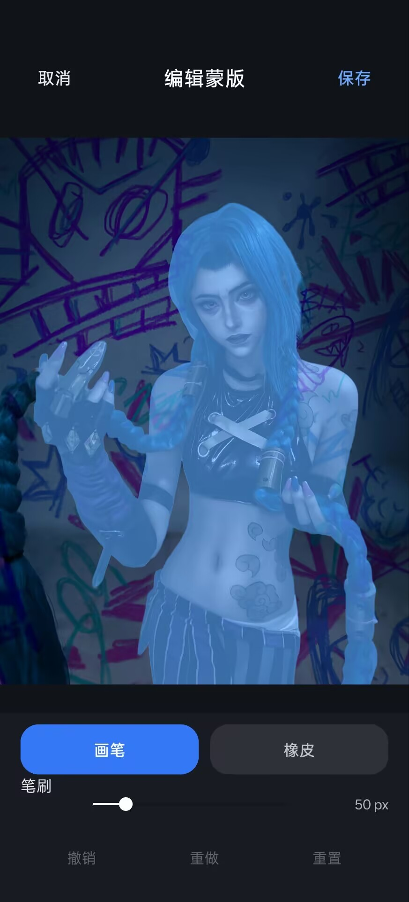

+++
authors = ["canxin"]
title = "ColorOSDepthMask：为 ColorOS 景深壁纸增加可编辑蒙版"
description = "介绍 ColorOSDepthMask 的用途、安装方法，以及如何使用 ColorOS 原生 AI、内置编辑器和外部 PNG 管理锁屏景深蒙版。"
date = 2026-09-05
updated = 2026-09-05
slug = "coloros-depthmask"
[taxonomies]
tags = ["ColorOS", "Android", "LSPosed", "景深壁纸", "Root", "开源项目"]
[extra]
toc = true
toc_inline = true
styles = ["css/coloros-depthmask.css"]
+++

> 项目地址：[canxin121/ColorOSDepthMask](https://github.com/canxin121/ColorOSDepthMask)

ColorOS 的锁屏景深功能会识别壁纸中的人物或主体，并将前景、时钟和其他界面元素分层显示，从而形成较明显的空间层次。

这套效果在系统自动抠图准确时表现较好，但其可调整空间相对有限。当前景深结果主要依赖系统 AI，对头发、手部、衣物边缘或复杂背景的识别出现偏差时，用户通常无法直接修改系统生成的前景区域。

`ColorOSDepthMask` 针对这一限制提供了一套补充方案。它通过 LSPosed 注入 ColorOS 壁纸编辑器，在原有景深流程中加入可编辑蒙版能力。用户既可以继续调用 ColorOS 原生 AI 生成蒙版，也可以对现有结果进行手工修整，或直接导入外部 PNG 蒙版。

自定义蒙版会按壁纸保存，并参与当前预览与最终锁屏资源生成。因此，修改后的前景不仅用于编辑页中的即时显示，也可以在重新进入同一张壁纸时继续恢复和使用。

下面两张图是 ColorOS 16 上的实际界面截图，分别对应锁屏编辑页入口和完整蒙版编辑器。

## 功能概览

<figure class="depthmask-screenshot">
  <a href="lockscreen-editor.jpg" data-lightbox="true">
    
  </a>
  <figcaption>锁屏编辑页中的「蒙版」入口，与 ColorOS 原生「景深」功能并列。</figcaption>
</figure>

模块并没有另外做一套独立的壁纸预览，而是直接嵌入 ColorOS 原有锁屏编辑页。截图里可以看到，**蒙版** 与系统自己的 **景深** 功能并列出现，完成蒙版修改后仍然沿用原生的缩放、裁切、时钟和最终应用流程。

ColorOSDepthMask 主要提供以下能力：

- 在 ColorOS 锁屏壁纸编辑页增加 **蒙版** 入口；
- 调用 ColorOS 原生 AI 自动生成景深蒙版；
- 在真实壁纸底图上继续编辑蒙版；
- 导入外部 PNG 蒙版；
- 支持画笔、橡皮、笔刷大小、撤销、重做、缩放和平移；
- 为不同壁纸分别保存蒙版；
- 保存后立即刷新当前景深预览；
- 手动控制景深开关；
- 在最终应用锁屏时使用当前自定义蒙版。

## 三种蒙版来源

点击编辑页底部的 **蒙版** 后，会直接打开当前壁纸对应的功能面板。这里提供 **自动生成、编辑、导入、反转和删除蒙版**；所有操作都绑定到当前壁纸，而不是一个全局蒙版。

### 使用 ColorOS 原生 AI 自动生成

最直接的方式是继续使用 ColorOS 自带的 AI 抠图能力。

进入锁屏壁纸编辑页后，选择 **蒙版 → 自动生成**，模块会调用系统原生 AI 生成当前壁纸的景深前景。生成完成后可以直接进入编辑器，对识别不完整的区域继续修整。

这种方式适合主体已经能够被系统较好识别，仅需对局部边缘进行补充的壁纸。系统 AI 负责完成基础分割，后续再由用户修正细节，可以显著减少手工绘制工作量。

### 在真实壁纸上编辑

<figure class="depthmask-screenshot">
  <a href="mask-editor.jpg" data-lightbox="true">
    
  </a>
  <figcaption>在真实壁纸底图上直接修整蒙版，支持画笔、橡皮、撤销、重做和笔刷大小调整。</figcaption>
</figure>

已有蒙版可以通过 **编辑** 继续修改；没有现成蒙版时，也可以从空白蒙版开始绘制。

编辑器会以当前锁屏壁纸作为底图，并在其上显示半透明蒙版覆盖层。当前支持：

- 画笔；
- 橡皮；
- 笔刷大小调节；
- 撤销 / 重做；
- 重置本次编辑；
- 单指绘制；
- 双指缩放和平移。

在真实壁纸上直接编辑的主要优势，是能够准确判断主体边缘与背景之间的关系。对于头发、衣物边缘和复杂轮廓，放大后逐步修整通常比单独编辑黑白蒙版更直观。

保存后，当前景深预览会自动刷新到最新 revision，无需退出 Wallpapers 后重新进入编辑页。当前版本还会阻止旧 Drawable、旧 AI 前景或之前导出的旧资源在异步回调中重新覆盖刚保存的蒙版，因此正常情况下不会再出现“先闪回旧蒙版，过一会儿才跳到新蒙版”的过程。

### 导入外部 PNG

对于习惯使用 Photoshop、Affinity Photo、GIMP 等图像工具的用户，可以直接导入外部 PNG 作为景深蒙版。

蒙版语义如下：

| 蒙版内容 | 含义 |
| --- | --- |
| 白色 / 不透明 | 前景 |
| 黑色 / 透明 | 背景 |
| 灰色 / 半透明 | 羽化或过渡区域 |

建议外部 PNG 与原始壁纸保持相同尺寸和比例，以减少后续裁切和缩放带来的偏差。

对于轮廓要求较高的壁纸，可以先使用 ColorOS AI 生成基础蒙版，再在内置编辑器中进行初步调整，最后使用外部图像工具完成更精细的处理。

## 自定义蒙版就是最终前景

从 v0.1.4 开始，自定义蒙版不再和 ColorOS 原始 AI 前景做并集或交集。只要当前壁纸存在自定义蒙版，它就直接作为最终景深前景定义。

这样做的目标很明确：**编辑器里画出来是什么，预览和最终锁屏就应该是什么**。最终效果不再额外依赖另一份系统 AI 蒙版，也就不会因为系统缓存、旧 AI 结果或异步回调而产生不可预测的差异。

仍然保留 **反转**，因为它只是在同一份自定义蒙版上交换前景 / 背景；删除蒙版后则恢复 ColorOS 原生行为。

## 蒙版持久化与状态一致性

仅在编辑页中替换当前显示的 bitmap 并不能完整解决实际使用中的问题。ColorOS 的景深状态同时涉及界面开关、当前预览、内部壁纸模型和最终锁屏资源生成等多个环节。

如果这些状态没有同步，可能出现以下情况：

```text
编辑页显示新的自定义蒙版
↓
点击应用
↓
最终锁屏仍使用之前的系统 AI 前景
```

也可能出现：

```text
景深开关显示为开启
↓
当前预览实际上没有景深效果
```

因此，ColorOSDepthMask 会在保存蒙版后同步当前壁纸的景深状态，并在重新进入同一张壁纸时尝试恢复之前保存的蒙版。

保存、导入或反转蒙版后，当前预览会立即更新；最终点击“应用”时，预览与导出会锁定到同一份当前蒙版 revision，并对 ColorOS 最终写出的前景文件进行校验，避免继续复用旧的前景结果。

此前部分情况下，保存蒙版后 ColorOS 的“应用”按钮仍会保持禁用状态，需要再次拖动壁纸才会恢复。现在模块会同步触发系统自身的“已编辑”状态，因此保存后可以直接继续应用。

## 景深开关保持手动控制

ColorOS 原生逻辑会根据 AI 识别结果和当前资源状态自动修改景深开关，包括自动开启、关闭、禁用或灰显。

对于系统完全自动生成的景深结果，这种逻辑有其合理性；但在已经存在用户自定义蒙版的情况下，是否启用景深更适合由用户自行决定。

因此，在自定义蒙版生效时，ColorOSDepthMask 会尽量保持景深开关的手动状态。用户开启时保持开启，关闭时保持关闭，不再由系统 AI 结果自动改变当前选择。

## 独立 App

除了 LSPosed 模块本身，ColorOSDepthMask 还包含一个独立控制 App，用于管理常用操作和诊断信息。

### 首页

首页只保留高频内容：

- 当前模块版本；
- `com.oplus.wallpapers` 版本；
- Root 状态；
- ColorOS / Android 摘要；
- GitHub Release 更新状态；
- 重载 Wallpapers；
- 重载 SystemUI。

安装或更新模块后，可以直接通过 **重载壁纸** 重新启动 `com.oplus.wallpapers`，使新的 Hook 重新加载。

### 诊断

诊断页用于集中查看运行环境，包括：

- 模块版本和签名；
- Wallpapers 版本；
- ColorOS / Android 信息；
- Root 管理器和 Root shell；
- LSPosed；
- Kernel；
- SELinux；
- Verified Boot 等。

每一项都可以单独复制，也可以一次复制完整诊断信息。出现系统更新或兼容性问题时，可以直接将这份信息附在 Issue 中。

### 项目

项目页提供以下入口：

- 项目仓库；
- Releases；
- Issues；
- 开发者 GitHub；
- Blog。

App 启动后还会检查 GitHub Releases。发现新版本时，可以直接下载 APK；下载完成后会检查包名、版本和签名，再交由 Android 系统安装器处理。

## 安装

目前主要针对以下环境进行开发和测试：

- ColorOS 16；
- Android 16；
- `com.oplus.wallpapers` 16.10.x；
- LSPosed；
- KernelSU / KernelSU Next / Magisk / APatch 等 Root 环境。

安装步骤如下：

1. 前往 [Releases](https://github.com/canxin121/ColorOSDepthMask/releases) 下载最新版 APK；
2. 安装 APK；
3. 在 LSPosed 中启用 **DepthMask**；
4. 作用域只勾选 `com.oplus.wallpapers`；
5. 打开 DepthMask App 并授予 Root；
6. 点击 **重载壁纸**；
7. 重新打开 ColorOS 锁屏壁纸编辑器。

正常情况下，锁屏编辑页底部功能栏会出现新的 **蒙版** 入口。

> [!NOTE]
> Root 主要用于独立 App 重载 Wallpapers / SystemUI 和读取额外诊断信息。LSPosed 模块的作用域仍然只需要 `com.oplus.wallpapers`，无需额外选择 SystemUI 或 Launcher。

## 基本使用流程

对于普通使用场景，可以按照以下顺序完成一张自定义景深壁纸：

1. 选择锁屏壁纸；
2. 进入 ColorOS 锁屏壁纸编辑器；
3. 点击 **蒙版**；
4. 点击 **自动生成**；
5. 在编辑器中修正 AI 漏检或误检区域；
6. 保存蒙版；
7. 手动开启 **景深**；
8. 检查预览；
9. 点击 **应用**。

如果系统 AI 无法正确识别主体，也可以跳过自动生成，直接从空白蒙版开始编辑，或导入已经制作好的 PNG。

## 兼容性说明

ColorOSDepthMask 依赖 `com.oplus.wallpapers` 的内部类、方法和资源，而这些内容并不属于公开稳定 API。

因此，ColorOS 或 Wallpapers 大版本更新后，模块可能需要重新适配。

如果系统更新后出现以下情况：

- 蒙版入口消失；
- 景深开关状态异常；
- 保存后预览没有刷新；
- 最终锁屏与编辑页预览不一致；

可以先在 DepthMask App 中执行一次 **重载壁纸**。如果问题仍然存在，可以进入诊断页复制完整诊断信息，并提交到 [GitHub Issues](https://github.com/canxin121/ColorOSDepthMask/issues)。

## 项目地址

- [GitHub 仓库](https://github.com/canxin121/ColorOSDepthMask)
- [Releases](https://github.com/canxin121/ColorOSDepthMask/releases)
- [Issues](https://github.com/canxin121/ColorOSDepthMask/issues)

ColorOSDepthMask 主要面向希望继续使用 ColorOS 原生锁屏景深能力，同时需要自行调整前景区域的用户。相比重新实现一套独立景深系统，它更强调与 ColorOS 现有编辑和应用流程保持一致。
