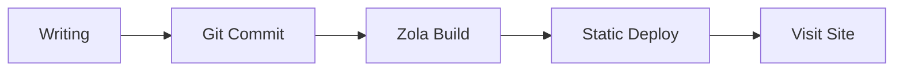
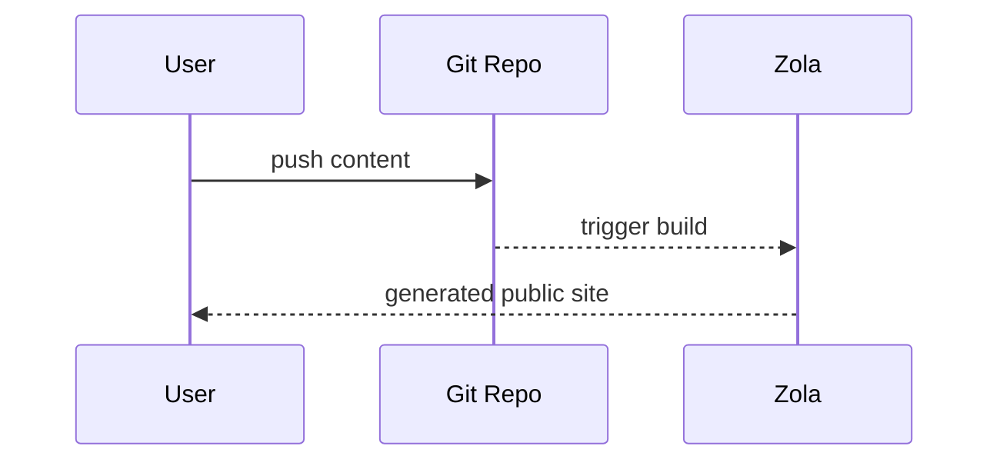

+++
authors = ["canxin"]
title = "ফিচার ডেমো ব্লগ: রিচ টেক্সট, Mermaid, গণিত এবং Shortcodes"
description = "এই ডেমো পোস্টে Duckquill + Zola-এর প্রধান ফরম্যাটিং ক্ষমতাগুলো দেখানো হয়েছে, যেমন Mermaid, KaTeX, টাস্ক লিস্ট, টেবিল, shortcodes এবং HTML এক্সটেনশন।"
date = 2026-02-13
updated = 2026-02-13
slug = "feature-demo-blog"
[taxonomies]
tags = ["demo", "zola", "duckquill", "markdown", "mermaid", "katex"]
[extra]
featured = true
toc = true
toc_inline = true
toc_ordered = true
toc_sidebar = false
katex = true
banner = "banner-feature-en.png"
accent_color = "#14897b"
accent_color_dark = "#4fd1b6"
emoji_favicon = "🧪"
styles = ["css/feature-demo-blog.css"]
scripts = ["js/feature-demo-blog.js"]
go_to_top = true
archive = "থিম এবং ইঞ্জিন আপডেটের সাথে এই পেজটি ক্রমাগত উন্নত হতে থাকবে।"
trigger = "এই পেজে অনেক ফরম্যাট ডেমো আছে (বাহ্যিক মিডিয়া, collapsible blocks এবং dynamic visuals সহ), তাই প্রয়োজনমতো সেকশন খুলে দেখুন।"
disclaimer = """
- এটি একটি প্রদর্শনী পেজ, যার মূল লক্ষ্য রেন্ডারিং ক্ষমতা দেখানো।
- কিছু ছবি/ভিডিও বাহ্যিক উৎস থেকে আসে, তাই লোড হতে সময়ের পার্থক্য থাকতে পারে।
"""
+++

এই পোস্টটি এই সাইটের **ডেমো ব্লগ পেজ**, যেখানে rich text এবং extended formatting সক্ষমতাগুলো একত্রে যাচাই করা হয়।

## মৌলিক Markdown সক্ষমতা

টেক্সট স্টাইল: **bold**, *italic*, ~~strikethrough~~, `inline code`, এবং মিলিয়ে লেখা ***~~all together~~***।

- অভ্যন্তরীণ লিংক: [Home](@/_index.md)
- বাহ্যিক লিংক: [Zola Documentation](https://www.getzola.org/documentation/)
- Emoji: 😭😂🥺🤣❤️✨🙏😍🥰😊

> এটি একটি quote block।
>
> এখানে nested quote-এর উদাহরণ:
> > Duckquill পরিষ্কার ও কাঠামোবদ্ধ টেকনিক্যাল লেখার জন্য দারুণ।

## তালিকা, টাস্ক এবং Footnotes

- সাধারণ তালিকা আইটেম A
- সাধারণ তালিকা আইটেম B
  - নেস্টেড আইটেম B.1
  - নেস্টেড আইটেম B.2
- সাধারণ তালিকা আইটেম C

1. কনটেন্ট লিখুন
2. লোকাল প্রিভিউ দেখুন
3. প্রকাশ করুন

- [x] কাজ 1: সাধারণ Markdown এক্সটেনশন সক্রিয় করা
- [x] কাজ 2: Mermaid সমর্থন যোগ করা
- [x] কাজ 3: এটিকে showcase পোস্টে রিফ্যাক্টর করা
- [ ] কাজ 4: বাস্তব ব্যবহারভিত্তিক আরও উদাহরণ যোগ করতে থাকা

Footnote উদাহরণ[^note1] এবং লিংকসহ footnote[^note2]।

Definition List উদাহরণ:

Mermaid
: টেক্সট দিয়ে গ্রাফ স্ট্রাকচার বর্ণনা করুন, তারপর সেটি স্বয়ংক্রিয়ভাবে SVG-তে রেন্ডার করুন।

KaTeX
: LaTeX গণিত সূত্রের জন্য উচ্চ-কার্যক্ষম রেন্ডারিং।

Duckquill Shortcodes
: থিম-লেভেলের ফিচার এক্সটেনশন, যেমন `alert`, `image`, `video`, এবং `youtube`।

## টেবিল এবং কোড হাইলাইটিং

| ফিচার | অবস্থা | নোট |
| :-- | :--: | :-- |
| GitHub Alerts | Enabled | `[!NOTE]` এবং সংশ্লিষ্ট সিনট্যাক্স সমর্থিত |
| Syntax Highlighting | Enabled | লাইন নম্বর ও highlighted lines সমর্থিত |
| Mermaid | Enabled | `mermaid` code block থেকে রেন্ডারিং সমর্থিত |
| KaTeX | এই পেজে Enabled | `extra.katex = true` এর মাধ্যমে |

```rust
fn main() {
    println!("Duckquill demo blog");
}
```

```toml, linenos, hl_lines=2-4
[extra]
show_copy_button = true
show_reading_time = true
show_share_button = true
```

## GitHub-স্টাইল Alerts

> [!NOTE]
> এটি একটি NOTE alert, যা প্রাসঙ্গিক পটভূমি দিতে ব্যবহৃত হয়।

> [!TIP]
> এটি একটি TIP alert, যা ব্যবহারিক পরামর্শ দেওয়ার জন্য ব্যবহৃত হয়।

> [!IMPORTANT]
> এটি একটি IMPORTANT alert, যা গুরুত্বপূর্ণ ধাপগুলোকে জোর দেয়।

> [!WARNING]
> এটি একটি WARNING alert, যা সম্ভাব্য সমস্যার বিষয়ে সতর্ক করে।

> [!CAUTION]
> এটি একটি CAUTION alert, যা ঝুঁকিপূর্ণ আচরণ বোঝাতে ব্যবহৃত হয়।

## KaTeX সূত্র

Inline formula: $E = mc^2$.

Block formula:

$$
f(x) = \int_{-\infty}^{\infty}\hat{f}(\xi)e^{2\pi i\xi x}\,d\xi
$$

## Mermaid ডায়াগ্রাম

নিচের `mermaid` block একটি flowchart হিসেবে রেন্ডার হয়:



আরেকটি sequence diagram উদাহরণ:



## Duckquill Shortcodes

`alert` shortcode (GitHub alerts থেকে আলাদা; এটি থিম shortcode):


এটি একটি `note` shortcode alert।



এটি একটি `tip` shortcode alert।



এটি একটি `important` shortcode alert।



এটি একটি `warning` shortcode alert।



এটি একটি `caution` shortcode alert।


Image shortcode (মৌলিক ব্যবহার):

{{ image(url="figure-demo.svg", alt="Local feature demo figure", full=true, no_hover=true, transparent=true) }}

Image shortcode (আরও অপশন):

{{ image(url="https://upload.wikimedia.org/wikipedia/commons/b/b4/JPEG_example_JPG_RIP_100.jpg", url_min="https://upload.wikimedia.org/wikipedia/commons/3/38/JPEG_example_JPG_RIP_010.jpg", alt="Compressed preview demo", no_hover=true) }}

{{ image(url="figure-demo.svg", alt="Feature local figure", full=true, no_hover=true, transparent=true) }}

{{ image(url="figure-demo.svg", alt="Float start demo", start=true, no_hover=true, transparent=true) }}
এই লেখাটি `start` floating image আচরণ দেখায়, যেখানে ছবি অনুচ্ছেদের শুরুর দিকে লেগে থাকে।

\
{{ image(url="figure-demo.svg", alt="Float end demo", end=true, no_hover=true, transparent=true) }}
এই লেখাটি `end` floating image আচরণ দেখায়, যেখানে ছবি অনুচ্ছেদের শেষ দিকে লেগে থাকে।

{{ image(url="https://files.catbox.moe/lk7nee.jpg", alt="Spoiler image demo", spoiler=true) }}

{{ image(url="https://files.catbox.moe/lk7nee.jpg", alt="Solid spoiler image demo", spoiler=true, solid=true) }}

Video shortcode (মৌলিক ও autoplay উদাহরণ):

{{ video(url="https://interactive-examples.mdn.mozilla.net/media/cc0-videos/flower.webm", alt="Flower wake up", controls=true, muted=true, loop=true) }}

{{ video(url="https://upload.wikimedia.org/wikipedia/commons/transcoded/0/0e/Duckling_preening_%2881313%29.webm/Duckling_preening_%2881313%29.webm.720p.vp9.webm", alt="Duckling preening", controls=true, autoplay=true, muted=true, playsinline=true) }}

YouTube / Vimeo / Mastodon shortcode লিংকসমূহ:

- [YouTube example link](https://www.youtube.com/watch?v=0Da8ZhKcNKQ)
- [Vimeo example link](https://vimeo.com/)
- [Mastodon example link](https://toot.community/@sungsphinx/111789185826519979)

(নোট: এই showcase-এ third-party embed থেকে অপ্রয়োজনীয় console output এড়াতে এগুলোকে লিংক হিসেবে দেখানো হয়েছে।)

CRT shortcode:


```text
user@duckquill-demo:~$ zola check
Checking site...
-> Site content: OK
```


## HTML এক্সটেনশন সক্ষমতা

<details>
  <summary>collapsible panel খুলতে ক্লিক করুন</summary>

  এখানে আপনি যেকোনো কনটেন্ট রাখতে পারেন, যেমন তালিকা, ছবি বা code snippets।

  - Collapsible কনটেন্ট A
  - Collapsible কনটেন্ট B
</details>

<aside>
এটি একটি `aside` ব্লক, যা সহায়ক নোটের জন্য উপযোগী।
</aside>

সাধারণ inline HTML tags-ও সরাসরি কাজ করে:

- <abbr title="American Standard Code for Information Interchange">ASCII</abbr>
- <kbd>Ctrl</kbd> + <kbd>K</kbd>
- <mark>highlighted key text</mark>
- <span class="spoiler">this is a spoiler text</span>
- <span class="spoiler solid">this is a solid spoiler text</span>
- <del>old plan</del> <ins>new plan</ins>
- <q>this is an inline quotation</q>
- <samp>demo-output.log: all checks passed</samp>
- <u>this sentence is underlined</u>

<small>এটি `<small>` সাইড-নোট টেক্সটের একটি উদাহরণ।</small>

Form এবং interaction widget উদাহরণ:

<ul>
  <li><input class="switch" type="checkbox" checked /><label>&nbsp;Mermaid সক্রিয় করুন</label></li>
  <li><input class="switch" type="checkbox" /><label>&nbsp;KaTeX সক্রিয় করুন</label></li>
  <li><input class="switch big" type="checkbox" checked /><label>&nbsp;Backlinks সক্রিয় করুন</label></li>
  <li><input type="radio" name="theme-demo" checked /><label>&nbsp;Dark</label></li>
  <li><input type="radio" name="theme-demo" /><label>&nbsp;Light</label></li>
</ul>

<label for="accent-color">Accent color:</label>
<input id="accent-color" type="color" value="#14897b" />

<label for="demo-range">Content density:</label>
<input id="demo-range" type="range" max="100" value="72" />

<div id="demo-live-panel">
  <small id="accent-preview">Current accent color: #14897b</small>
  <small id="density-preview">Content density: 72%</small>
</div>

Image + caption কম্পোজিশন (`figure` + `figcaption`):

<figure>
  
  <figcaption>লোকাল ছবি + figcaption (বাহ্যিক নির্ভরতা নেই, রেন্ডার স্থিতিশীল)।</figcaption>
</figure>

Progress bar উদাহরণ (range input-এর সাথে page script দ্বারা যুক্ত):

<progress id="density-progress" value="72" max="100"></progress>

## বাটন এবং দ্রুত নেভিগেশন

<div class="buttons">
  <a href="#top">উপরে ফিরে যান</a>
  <a class="colored external" href="https://www.getzola.org/documentation/content/overview/">Zola content ডকস পড়ুন</a>
</div>

<div class="buttons centered">
  <button class="big colored" type="button" disabled>বড় বাটন স্টাইল ডেমো</button>
</div>

## পেজ-লেভেল Front Matter ফিচার

`featured = true` ছাড়াও, এই পেজটি আরও দেখায়:

- `banner = "banner-feature-en.png"`: পোস্ট ব্যানার এবং তালিকা থাম্বনেইল।
- `accent_color` / `accent_color_dark`: পেজ-লেভেল accent override।
- `styles = ["css/feature-demo-blog.css"]` এবং `scripts = ["js/feature-demo-blog.js"]`: পেজ-স্কোপড styles ও scripts।
- `emoji_favicon = "🧪"`: ব্রাউজার ট্যাবের জন্য emoji favicon।

এই অংশটি পেজ-লেভেল কনফিগ রেন্ডারিং যাচাইয়ের একটি সংক্ষিপ্ত checklist।

## Backlinks ডেমো

আমি [about](@/_index.md) পেজ থেকে এই পোস্টে একটি লিংক যোগ করেছি।

যদি quick-action বাটনে `Backlinks` দেখা যায়, তাহলে internal backlink index প্রত্যাশামতো কাজ করছে।

---

উপরের সব মডিউল ঠিকভাবে রেন্ডার হলে বোঝা যায়, ব্লগের rich-text সক্ষমতা এখন বেশিরভাগ সাধারণ লেখার দৃশ্যপট কভার করছে।

[^note1]: Footnotes মূল পড়ার প্রবাহ ব্যাহত না করে অতিরিক্ত ব্যাখ্যা দেওয়ার ভালো উপায়।
[^note2]: [Footnotes-এ লিংকও থাকতে পারে](https://www.getzola.org/documentation/content/overview/)
