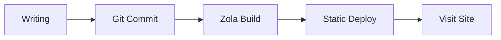
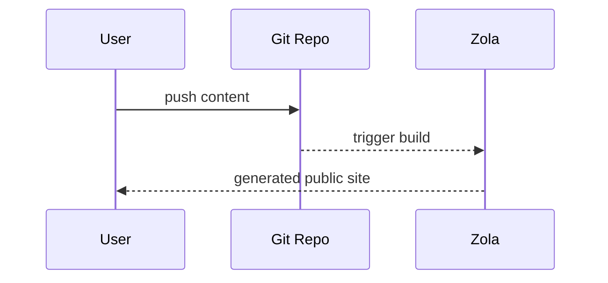
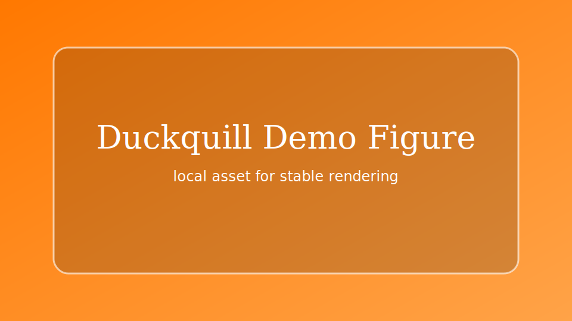

+++
authors = ["canxin"]
title = "Feature Demo Blog: Rich Text, Mermaid, Math, and Shortcodes"
description = "This demo post showcases the major formatting capabilities supported by Duckquill + Zola, including Mermaid, KaTeX, task lists, tables, shortcodes, and HTML extensions."
date = 2026-02-13
updated = 2026-02-13
slug = "feature-demo-blog"
[taxonomies]
tags = ["demo", "zola", "duckquill", "markdown", "mermaid", "katex"]
[extra]
featured = true
toc = true
toc_inline = true
toc_ordered = true
toc_sidebar = false
katex = true
banner = "banner-feature-en.png"
accent_color = "#14897b"
accent_color_dark = "#4fd1b6"
emoji_favicon = "🧪"
styles = ["css/feature-demo-blog.css"]
scripts = ["js/feature-demo-blog.js"]
go_to_top = true
archive = "This page will keep evolving as the theme and engine are updated."
trigger = "This page contains many format demos (including external media, collapsible blocks, and dynamic visuals), so feel free to expand sections as needed."
disclaimer = """
- This is a showcase page, focused on rendering capabilities.
- Some images/videos come from external sources and may load at different speeds.
"""
+++

This post is the **demo blog page** of this site, used to centralize and verify rich-text and extended formatting capabilities.

## Basic Markdown Capabilities

Text styles: **bold**, *italic*, ~~strikethrough~~, `inline code`, and even combined style ***~~all together~~***.

- Internal link: [Home](@/_index.md)
- External link: [Zola Documentation](https://www.getzola.org/documentation/)
- Emoji: 😭😂🥺🤣❤️✨🙏😍🥰😊

> This is a quote block.
>
> Here is a nested quote:
> > Duckquill is great for clear and structured technical writing.

## Lists, Tasks, and Footnotes

- Normal list item A
- Normal list item B
  - Nested item B.1
  - Nested item B.2
- Normal list item C

1. Write content
2. Preview locally
3. Publish

- [x] Task 1: Enable common Markdown extensions
- [x] Task 2: Add Mermaid support
- [x] Task 3: Refactor into a showcase post
- [ ] Task 4: Keep adding practical real-world examples

Footnote example[^note1] and linked footnote[^note2].

Definition List example:

Mermaid
: Describe graph structures with text, then render them into SVG automatically.

KaTeX
: High-performance rendering for LaTeX math formulas.

Duckquill Shortcodes
: Theme-level feature extensions, such as `alert`, `image`, `video`, and `youtube`.

## Tables and Code Highlighting

| Feature | Status | Notes |
| :-- | :--: | :-- |
| GitHub Alerts | Enabled | Supports `[!NOTE]` and related syntax |
| Syntax Highlighting | Enabled | Supports line numbers and highlighted lines |
| Mermaid | Enabled | Supports rendering from `mermaid` code blocks |
| KaTeX | Enabled on this page | Via `extra.katex = true` |

```rust
fn main() {
    println!("Duckquill demo blog");
}
```

```toml, linenos, hl_lines=2-4
[extra]
show_copy_button = true
show_reading_time = true
show_share_button = true
```

## GitHub-style Alerts

> [!NOTE]
> This is a NOTE alert used to provide background context.

> [!TIP]
> This is a TIP alert used for practical suggestions.

> [!IMPORTANT]
> This is an IMPORTANT alert used to emphasize critical steps.

> [!WARNING]
> This is a WARNING alert used to call out potential issues.

> [!CAUTION]
> This is a CAUTION alert used to describe risky behavior.

## KaTeX Formulas

Inline formula: $E = mc^2$.

Block formula:

$$
f(x) = \int_{-\infty}^{\infty}\hat{f}(\xi)e^{2\pi i\xi x}\,d\xi
$$

## Mermaid Diagrams

The following `mermaid` block is rendered as a flowchart:



Another sequence diagram example:



## Duckquill Shortcodes

`alert` shortcode (different from GitHub alerts; this is theme shortcode):


This is a `note` shortcode alert.



This is a `tip` shortcode alert.



This is an `important` shortcode alert.



This is a `warning` shortcode alert.



This is a `caution` shortcode alert.


Image shortcode (basic usage):

{{ image(url="figure-demo.svg", alt="Local feature demo figure", full=true, no_hover=true, transparent=true) }}

Image shortcode (more options):

{{ image(url="https://upload.wikimedia.org/wikipedia/commons/b/b4/JPEG_example_JPG_RIP_100.jpg", url_min="https://upload.wikimedia.org/wikipedia/commons/3/38/JPEG_example_JPG_RIP_010.jpg", alt="Compressed preview demo", no_hover=true) }}

{{ image(url="figure-demo.svg", alt="Feature local figure", full=true, no_hover=true, transparent=true) }}

{{ image(url="figure-demo.svg", alt="Float start demo", start=true, no_hover=true, transparent=true) }}
This text demonstrates the `start` floating image behavior, where the image sticks to the start side of the paragraph.

\
{{ image(url="figure-demo.svg", alt="Float end demo", end=true, no_hover=true, transparent=true) }}
This text demonstrates the `end` floating image behavior, where the image sticks to the end side of the paragraph.

{{ image(url="https://files.catbox.moe/lk7nee.jpg", alt="Spoiler image demo", spoiler=true) }}

{{ image(url="https://files.catbox.moe/lk7nee.jpg", alt="Solid spoiler image demo", spoiler=true, solid=true) }}

Video shortcode (basic and autoplay examples):

{{ video(url="https://interactive-examples.mdn.mozilla.net/media/cc0-videos/flower.webm", alt="Flower wake up", controls=true, muted=true, loop=true) }}

{{ video(url="https://upload.wikimedia.org/wikipedia/commons/transcoded/0/0e/Duckling_preening_%2881313%29.webm/Duckling_preening_%2881313%29.webm.720p.vp9.webm", alt="Duckling preening", controls=true, autoplay=true, muted=true, playsinline=true) }}

YouTube / Vimeo / Mastodon shortcode links:

- [YouTube example link](https://www.youtube.com/watch?v=0Da8ZhKcNKQ)
- [Vimeo example link](https://vimeo.com/)
- [Mastodon example link](https://toot.community/@sungsphinx/111789185826519979)

(Note: to avoid noisy console output from third-party embeds in this showcase, these are shown as links.)

CRT shortcode:


```text
user@duckquill-demo:~$ zola check
Checking site...
-> Site content: OK
```


## HTML Extension Capabilities

<details>
  <summary>Click to expand a collapsible panel</summary>

  You can put any content here, including lists, images, or code snippets.

  - Collapsible content A
  - Collapsible content B
</details>

<aside>
This is an `aside` block, useful for supplementary notes.
</aside>

Common inline HTML tags also work directly:

- <abbr title="American Standard Code for Information Interchange">ASCII</abbr>
- <kbd>Ctrl</kbd> + <kbd>K</kbd>
- <mark>highlighted key text</mark>
- <span class="spoiler">this is a spoiler text</span>
- <span class="spoiler solid">this is a solid spoiler text</span>
- <del>old plan</del> <ins>new plan</ins>
- <q>this is an inline quotation</q>
- <samp>demo-output.log: all checks passed</samp>
- <u>this sentence is underlined</u>

<small>This is a `<small>` side note text example.</small>

Form and interaction widget examples:

<ul>
  <li><input class="switch" type="checkbox" checked /><label>&nbsp;Enable Mermaid</label></li>
  <li><input class="switch" type="checkbox" /><label>&nbsp;Enable KaTeX</label></li>
  <li><input class="switch big" type="checkbox" checked /><label>&nbsp;Enable Backlinks</label></li>
  <li><input type="radio" name="theme-demo" checked /><label>&nbsp;Dark</label></li>
  <li><input type="radio" name="theme-demo" /><label>&nbsp;Light</label></li>
</ul>

<label for="accent-color">Accent color:</label>
<input id="accent-color" type="color" value="#14897b" />

<label for="demo-range">Content density:</label>
<input id="demo-range" type="range" max="100" value="72" />

<div id="demo-live-panel">
  <small id="accent-preview">Current accent color: #14897b</small>
  <small id="density-preview">Content density: 72%</small>
</div>

Image + caption composition (`figure` + `figcaption`):

<figure>
  
  <figcaption>Local image + figcaption (no external dependency, stable to render).</figcaption>
</figure>

Progress bar example (linked with the range input through page script):

<progress id="density-progress" value="72" max="100"></progress>

## Buttons and Quick Navigation

<div class="buttons">
  <a href="#top">Back to top</a>
  <a class="colored external" href="https://www.getzola.org/documentation/content/overview/">Read Zola content docs</a>
</div>

<div class="buttons centered">
  <button class="big colored" type="button" disabled>Large button style demo</button>
</div>

## Page-level Front Matter Features

Besides `featured = true`, this page also demonstrates:

- `banner = "banner-feature-en.png"`: post banner and list thumbnail.
- `accent_color` / `accent_color_dark`: page-level accent override.
- `styles = ["css/feature-demo-blog.css"]` and `scripts = ["js/feature-demo-blog.js"]`: page-scoped styles and scripts.
- `emoji_favicon = "🧪"`: emoji favicon for the browser tab.

This section is a compact checklist for validating page-level config rendering.

## Backlinks Demo

I have added a link to this post from the [about](@/_index.md) page.

If a `Backlinks` item appears in the quick-action buttons, the internal backlink index is working as expected.

---

If all modules above render correctly, it means the blog's rich-text capability now covers most common writing scenarios.

[^note1]: Footnotes are great for extra explanation without interrupting the main reading flow.
[^note2]: [Footnotes can also contain links](https://www.getzola.org/documentation/content/overview/)
