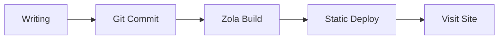
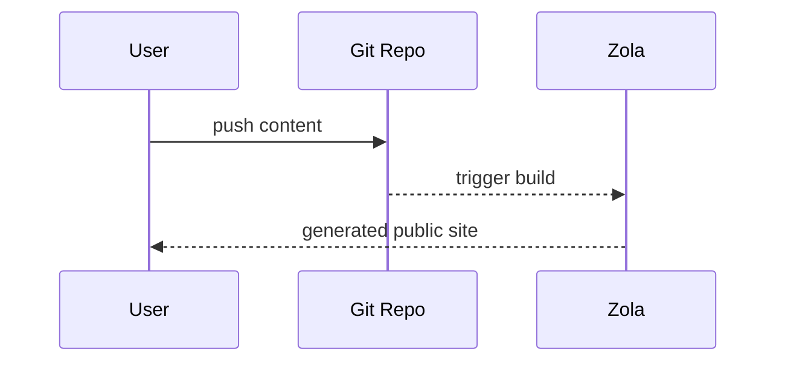

+++
authors = ["canxin"]
title = "फ़ीचर डेमो ब्लॉग: रिच टेक्स्ट, Mermaid, गणित और Shortcodes"
description = "यह डेमो पोस्ट Duckquill + Zola की प्रमुख फ़ॉर्मेटिंग क्षमताएं दिखाती है, जिनमें Mermaid, KaTeX, टास्क लिस्ट, टेबल, shortcodes और HTML एक्सटेंशन शामिल हैं।"
date = 2026-02-13
updated = 2026-02-13
slug = "feature-demo-blog"
[taxonomies]
tags = ["demo", "zola", "duckquill", "markdown", "mermaid", "katex"]
[extra]
featured = true
toc = true
toc_inline = true
toc_ordered = true
toc_sidebar = false
katex = true
banner = "banner-feature-en.png"
accent_color = "#14897b"
accent_color_dark = "#4fd1b6"
emoji_favicon = "🧪"
styles = ["css/feature-demo-blog.css"]
scripts = ["js/feature-demo-blog.js"]
go_to_top = true
archive = "थीम और इंजन अपडेट होने के साथ यह पेज लगातार विकसित होता रहेगा।"
trigger = "इस पेज में कई फ़ॉर्मेट डेमो हैं (बाहरी मीडिया, collapsible blocks और dynamic visuals सहित), इसलिए जरूरत के अनुसार सेक्शन खोलकर देखें।"
disclaimer = """
- यह एक प्रदर्शन पेज है, जिसका मुख्य उद्देश्य रेंडरिंग क्षमताएं दिखाना है।
- कुछ चित्र/वीडियो बाहरी स्रोतों से हैं, इसलिए लोड होने की गति अलग हो सकती है।
"""
+++

यह पोस्ट इस साइट का **डेमो ब्लॉग पेज** है, जिसका उपयोग rich text और extended formatting क्षमताओं को एक जगह सत्यापित करने के लिए किया जाता है।

## बुनियादी Markdown क्षमताएं

टेक्स्ट स्टाइल: **bold**, *italic*, ~~strikethrough~~, `inline code`, और मिला-जुला स्टाइल ***~~all together~~***।

- आंतरिक लिंक: [Home](@/_index.md)
- बाहरी लिंक: [Zola Documentation](https://www.getzola.org/documentation/)
- Emoji: 😭😂🥺🤣❤️✨🙏😍🥰😊

> यह एक quote block है।
>
> यहां nested quote का उदाहरण है:
> > Duckquill स्पष्ट और संरचित तकनीकी लेखन के लिए बहुत अच्छा है।

## सूचियां, टास्क और Footnotes

- सामान्य सूची आइटम A
- सामान्य सूची आइटम B
  - नेस्टेड आइटम B.1
  - नेस्टेड आइटम B.2
- सामान्य सूची आइटम C

1. सामग्री लिखें
2. लोकल प्रीव्यू देखें
3. प्रकाशित करें

- [x] कार्य 1: सामान्य Markdown एक्सटेंशन सक्षम करें
- [x] कार्य 2: Mermaid समर्थन जोड़ें
- [x] कार्य 3: इसे showcase पोस्ट में पुनर्गठित करें
- [ ] कार्य 4: वास्तविक उपयोग के और उदाहरण जोड़ते रहें

Footnote उदाहरण[^note1] और लिंक वाला footnote[^note2]।

Definition List उदाहरण:

Mermaid
: टेक्स्ट से ग्राफ़ संरचना लिखें और उसे अपने-आप SVG में रेंडर करें।

KaTeX
: LaTeX गणितीय सूत्रों के लिए उच्च-प्रदर्शन रेंडरिंग।

Duckquill Shortcodes
: थीम-स्तरीय फीचर एक्सटेंशन, जैसे `alert`, `image`, `video`, और `youtube`।

## टेबल और कोड हाइलाइटिंग

| सुविधा | स्थिति | टिप्पणियां |
| :-- | :--: | :-- |
| GitHub Alerts | Enabled | `[!NOTE]` और संबंधित सिंटैक्स समर्थित |
| Syntax Highlighting | Enabled | लाइन नंबर और highlighted lines समर्थित |
| Mermaid | Enabled | `mermaid` code blocks से रेंडरिंग समर्थित |
| KaTeX | इस पेज पर Enabled | `extra.katex = true` के माध्यम से |

```rust
fn main() {
    println!("Duckquill demo blog");
}
```

```toml, linenos, hl_lines=2-4
[extra]
show_copy_button = true
show_reading_time = true
show_share_button = true
```

## GitHub-शैली Alerts

> [!NOTE]
> यह NOTE alert है, जिसे पृष्ठभूमि संदर्भ देने के लिए उपयोग किया जाता है।

> [!TIP]
> यह TIP alert है, जो व्यावहारिक सुझावों के लिए उपयोग होता है।

> [!IMPORTANT]
> यह IMPORTANT alert है, जो महत्वपूर्ण चरणों पर जोर देता है।

> [!WARNING]
> यह WARNING alert है, जो संभावित समस्याओं की ओर संकेत करता है।

> [!CAUTION]
> यह CAUTION alert है, जो जोखिमपूर्ण व्यवहार बताने के लिए उपयोग होता है।

## KaTeX सूत्र

Inline formula: $E = mc^2$.

Block formula:

$$
f(x) = \int_{-\infty}^{\infty}\hat{f}(\xi)e^{2\pi i\xi x}\,d\xi
$$

## Mermaid आरेख

नीचे दिया गया `mermaid` block flowchart के रूप में रेंडर होता है:



एक sequence diagram का उदाहरण:



## Duckquill Shortcodes

`alert` shortcode (GitHub alerts से अलग; यह थीम shortcode है):


यह `note` shortcode alert है।



यह `tip` shortcode alert है।



यह `important` shortcode alert है।



यह `warning` shortcode alert है।



यह `caution` shortcode alert है।


Image shortcode (मूल उपयोग):

{{ image(url="figure-demo.svg", alt="Local feature demo figure", full=true, no_hover=true, transparent=true) }}

Image shortcode (अधिक विकल्प):

{{ image(url="https://upload.wikimedia.org/wikipedia/commons/b/b4/JPEG_example_JPG_RIP_100.jpg", url_min="https://upload.wikimedia.org/wikipedia/commons/3/38/JPEG_example_JPG_RIP_010.jpg", alt="Compressed preview demo", no_hover=true) }}

{{ image(url="figure-demo.svg", alt="Feature local figure", full=true, no_hover=true, transparent=true) }}

{{ image(url="figure-demo.svg", alt="Float start demo", start=true, no_hover=true, transparent=true) }}
यह टेक्स्ट `start` floating image व्यवहार दिखाता है, जहां छवि अनुच्छेद की शुरुआत वाली तरफ चिपकती है।

\
{{ image(url="figure-demo.svg", alt="Float end demo", end=true, no_hover=true, transparent=true) }}
यह टेक्स्ट `end` floating image व्यवहार दिखाता है, जहां छवि अनुच्छेद के अंत वाली तरफ चिपकती है।

{{ image(url="https://files.catbox.moe/lk7nee.jpg", alt="Spoiler image demo", spoiler=true) }}

{{ image(url="https://files.catbox.moe/lk7nee.jpg", alt="Solid spoiler image demo", spoiler=true, solid=true) }}

Video shortcode (मूल और autoplay उदाहरण):

{{ video(url="https://interactive-examples.mdn.mozilla.net/media/cc0-videos/flower.webm", alt="Flower wake up", controls=true, muted=true, loop=true) }}

{{ video(url="https://upload.wikimedia.org/wikipedia/commons/transcoded/0/0e/Duckling_preening_%2881313%29.webm/Duckling_preening_%2881313%29.webm.720p.vp9.webm", alt="Duckling preening", controls=true, autoplay=true, muted=true, playsinline=true) }}

YouTube / Vimeo / Mastodon shortcode लिंक्स:

- [YouTube example link](https://www.youtube.com/watch?v=0Da8ZhKcNKQ)
- [Vimeo example link](https://vimeo.com/)
- [Mastodon example link](https://toot.community/@sungsphinx/111789185826519979)

(ध्यान दें: इस showcase में third-party embeds से शोरगुल वाले console output से बचने के लिए इन्हें लिंक के रूप में दिखाया गया है।)

CRT shortcode:


```text
user@duckquill-demo:~$ zola check
Checking site...
-> Site content: OK
```


## HTML एक्सटेंशन क्षमताएं

<details>
  <summary>क्लिक करके collapsible panel खोलें</summary>

  आप यहां कोई भी सामग्री रख सकते हैं, जिसमें सूचियां, चित्र या code snippets शामिल हैं।

  - Collapsible सामग्री A
  - Collapsible सामग्री B
</details>

<aside>
यह `aside` ब्लॉक है, जो पूरक नोट्स के लिए उपयोगी है।
</aside>

सामान्य inline HTML tags भी सीधे काम करते हैं:

- <abbr title="American Standard Code for Information Interchange">ASCII</abbr>
- <kbd>Ctrl</kbd> + <kbd>K</kbd>
- <mark>highlighted key text</mark>
- <span class="spoiler">this is a spoiler text</span>
- <span class="spoiler solid">this is a solid spoiler text</span>
- <del>old plan</del> <ins>new plan</ins>
- <q>this is an inline quotation</q>
- <samp>demo-output.log: all checks passed</samp>
- <u>this sentence is underlined</u>

<small>यह `<small>` साइड-नोट टेक्स्ट का उदाहरण है।</small>

Form और interaction widget उदाहरण:

<ul>
  <li><input class="switch" type="checkbox" checked /><label>&nbsp;Mermaid सक्षम करें</label></li>
  <li><input class="switch" type="checkbox" /><label>&nbsp;KaTeX सक्षम करें</label></li>
  <li><input class="switch big" type="checkbox" checked /><label>&nbsp;Backlinks सक्षम करें</label></li>
  <li><input type="radio" name="theme-demo" checked /><label>&nbsp;Dark</label></li>
  <li><input type="radio" name="theme-demo" /><label>&nbsp;Light</label></li>
</ul>

<label for="accent-color">Accent color:</label>
<input id="accent-color" type="color" value="#14897b" />

<label for="demo-range">Content density:</label>
<input id="demo-range" type="range" max="100" value="72" />

<div id="demo-live-panel">
  <small id="accent-preview">Current accent color: #14897b</small>
  <small id="density-preview">Content density: 72%</small>
</div>

Image + caption संयोजन (`figure` + `figcaption`):

<figure>
  
  <figcaption>स्थानीय छवि + figcaption (कोई बाहरी निर्भरता नहीं, रेंडरिंग स्थिर रहती है)।</figcaption>
</figure>

Progress bar उदाहरण (range input से page script द्वारा जुड़ा हुआ):

<progress id="density-progress" value="72" max="100"></progress>

## बटन और त्वरित नेविगेशन

<div class="buttons">
  <a href="#top">ऊपर जाएं</a>
  <a class="colored external" href="https://www.getzola.org/documentation/content/overview/">Zola content दस्तावेज़ पढ़ें</a>
</div>

<div class="buttons centered">
  <button class="big colored" type="button" disabled>बड़े बटन शैली का डेमो</button>
</div>

## पेज-स्तरीय Front Matter फीचर्स

`featured = true` के अलावा, यह पेज निम्न भी दिखाता है:

- `banner = "banner-feature-en.png"`: पोस्ट बैनर और सूची थंबनेल।
- `accent_color` / `accent_color_dark`: पेज-स्तरीय accent override।
- `styles = ["css/feature-demo-blog.css"]` और `scripts = ["js/feature-demo-blog.js"]`: पेज-स्कोप्ड styles और scripts।
- `emoji_favicon = "🧪"`: ब्राउज़र टैब के लिए emoji favicon।

यह सेक्शन पेज-स्तरीय कॉन्फ़िग रेंडरिंग की जांच के लिए एक संक्षिप्त checklist है।

## Backlinks डेमो

मैंने [about](@/_index.md) पेज से इस पोस्ट के लिए एक लिंक जोड़ा है।

यदि quick-action बटनों में `Backlinks` आइटम दिखता है, तो internal backlink index अपेक्षित रूप से काम कर रहा है।

---

यदि ऊपर के सभी मॉड्यूल सही रेंडर होते हैं, तो इसका अर्थ है कि ब्लॉग की rich-text क्षमता अब अधिकांश सामान्य लेखन परिदृश्यों को कवर करती है।

[^note1]: Footnotes मुख्य पढ़ने के प्रवाह को बाधित किए बिना अतिरिक्त व्याख्या देने का अच्छा तरीका हैं।
[^note2]: [Footnotes में links भी हो सकते हैं](https://www.getzola.org/documentation/content/overview/)
