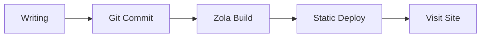
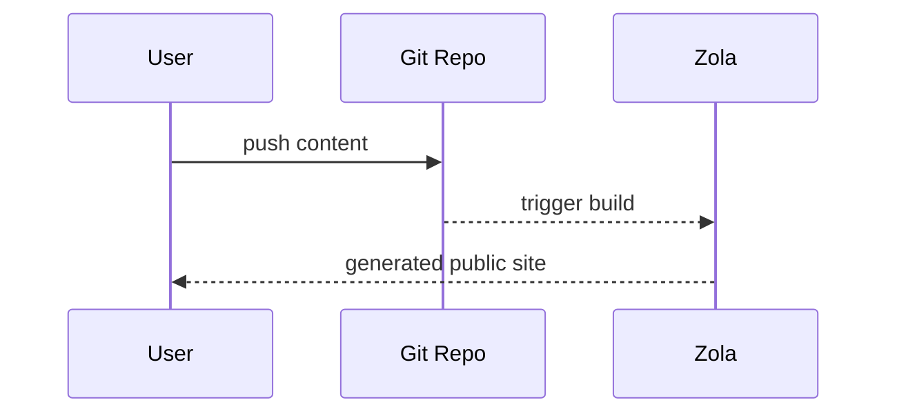

+++
authors = ["canxin"]
title = "Blog Demo Fitur: Rich Text, Mermaid, Matematika, dan Shortcode"
description = "Pos demo ini menampilkan kemampuan pemformatan utama yang didukung Duckquill + Zola, termasuk Mermaid, KaTeX, task list, tabel, shortcode, dan ekstensi HTML."
date = 2026-02-13
updated = 2026-02-13
slug = "feature-demo-blog"
[taxonomies]
tags = ["demo", "zola", "duckquill", "markdown", "mermaid", "katex"]
[extra]
featured = true
toc = true
toc_inline = true
toc_ordered = true
toc_sidebar = false
katex = true
banner = "banner-feature-en.png"
accent_color = "#14897b"
accent_color_dark = "#4fd1b6"
emoji_favicon = "🧪"
styles = ["css/feature-demo-blog.css"]
scripts = ["js/feature-demo-blog.js"]
go_to_top = true
archive = "Halaman ini akan terus berkembang seiring pembaruan tema dan engine."
trigger = "Halaman ini memuat banyak demo format (termasuk media eksternal, blok lipat, dan visual dinamis), jadi silakan buka bagian sesuai kebutuhan."
disclaimer = """
- Ini adalah halaman showcase, berfokus pada kemampuan rendering.
- Beberapa gambar/video berasal dari sumber eksternal dan bisa memiliki kecepatan muat yang berbeda.
"""
+++

Pos ini adalah **halaman blog demo** di situs ini, dipakai untuk memusatkan dan memverifikasi kemampuan rich text serta format lanjutan.

## Kemampuan Markdown Dasar

Gaya teks: **tebal**, *miring*, ~~coret~~, `kode inline`, bahkan gaya gabungan ***~~sekalian semua~~***.

- Tautan internal: [Beranda](@/_index.md)
- Tautan eksternal: [Dokumentasi Zola](https://www.getzola.org/documentation/)
- Emoji: 😭😂🥺🤣❤️✨🙏😍🥰😊

> Ini adalah blok kutipan.
>
> Berikut kutipan bersarang:
> > Duckquill sangat cocok untuk penulisan teknis yang jelas dan terstruktur.

## Daftar, Tugas, dan Catatan Kaki

- Item daftar biasa A
- Item daftar biasa B
  - Item bersarang B.1
  - Item bersarang B.2
- Item daftar biasa C

1. Tulis konten
2. Pratinjau lokal
3. Publikasikan

- [x] Tugas 1: Aktifkan ekstensi Markdown umum
- [x] Tugas 2: Tambahkan dukungan Mermaid
- [x] Tugas 3: Refaktor menjadi pos showcase
- [ ] Tugas 4: Terus tambahkan contoh praktis dunia nyata

Contoh catatan kaki[^note1] dan catatan kaki bertaut[^note2].

Contoh Definition List:

Mermaid
: Mendeskripsikan struktur graf dengan teks, lalu merendernya otomatis menjadi SVG.

KaTeX
: Rendering berperforma tinggi untuk rumus matematika LaTeX.

Duckquill Shortcodes
: Ekstensi fitur di tingkat tema, seperti `alert`, `image`, `video`, dan `youtube`.

## Tabel dan Sorotan Kode

| Fitur | Status | Catatan |
| :-- | :--: | :-- |
| GitHub Alerts | Aktif | Mendukung sintaks `[!NOTE]` dan sejenisnya |
| Syntax Highlighting | Aktif | Mendukung nomor baris dan baris yang disorot |
| Mermaid | Aktif | Mendukung rendering dari code block `mermaid` |
| KaTeX | Aktif di halaman ini | Melalui `extra.katex = true` |

```rust
fn main() {
    println!("Duckquill demo blog");
}
```

```toml, linenos, hl_lines=2-4
[extra]
show_copy_button = true
show_reading_time = true
show_share_button = true
```

## Alert Bergaya GitHub

> [!NOTE]
> Ini adalah alert NOTE yang digunakan untuk memberi konteks latar belakang.

> [!TIP]
> Ini adalah alert TIP yang digunakan untuk saran praktis.

> [!IMPORTANT]
> Ini adalah alert IMPORTANT yang digunakan untuk menegaskan langkah penting.

> [!WARNING]
> Ini adalah alert WARNING yang digunakan untuk menandai potensi masalah.

> [!CAUTION]
> Ini adalah alert CAUTION yang digunakan untuk menjelaskan perilaku berisiko.

## Rumus KaTeX

Rumus inline: $E = mc^2$.

Rumus blok:

$$
f(x) = \int_{-\infty}^{\infty}\hat{f}(\xi)e^{2\pi i\xi x}\,d\xi
$$

## Diagram Mermaid

Blok `mermaid` berikut akan dirender sebagai flowchart:



Contoh lain berupa diagram urutan:



## Shortcode Duckquill

Shortcode `alert` (berbeda dari GitHub alerts; ini shortcode tema):


Ini adalah alert shortcode `note`.



Ini adalah alert shortcode `tip`.



Ini adalah alert shortcode `important`.



Ini adalah alert shortcode `warning`.



Ini adalah alert shortcode `caution`.


Shortcode gambar (pemakaian dasar):

{{ image(url="figure-demo.svg", alt="Local feature demo figure", full=true, no_hover=true, transparent=true) }}

Shortcode gambar (opsi lebih lengkap):

{{ image(url="https://upload.wikimedia.org/wikipedia/commons/b/b4/JPEG_example_JPG_RIP_100.jpg", url_min="https://upload.wikimedia.org/wikipedia/commons/3/38/JPEG_example_JPG_RIP_010.jpg", alt="Compressed preview demo", no_hover=true) }}

{{ image(url="figure-demo.svg", alt="Feature local figure", full=true, no_hover=true, transparent=true) }}

{{ image(url="figure-demo.svg", alt="Float start demo", start=true, no_hover=true, transparent=true) }}
Teks ini mendemonstrasikan perilaku gambar mengambang `start`, yaitu gambar menempel di sisi awal paragraf.

\
{{ image(url="figure-demo.svg", alt="Float end demo", end=true, no_hover=true, transparent=true) }}
Teks ini mendemonstrasikan perilaku gambar mengambang `end`, yaitu gambar menempel di sisi akhir paragraf.

{{ image(url="https://files.catbox.moe/lk7nee.jpg", alt="Spoiler image demo", spoiler=true) }}

{{ image(url="https://files.catbox.moe/lk7nee.jpg", alt="Solid spoiler image demo", spoiler=true, solid=true) }}

Shortcode video (contoh dasar dan autoplay):

{{ video(url="https://interactive-examples.mdn.mozilla.net/media/cc0-videos/flower.webm", alt="Flower wake up", controls=true, muted=true, loop=true) }}

{{ video(url="https://upload.wikimedia.org/wikipedia/commons/transcoded/0/0e/Duckling_preening_%2881313%29.webm/Duckling_preening_%2881313%29.webm.720p.vp9.webm", alt="Duckling preening", controls=true, autoplay=true, muted=true, playsinline=true) }}

Tautan shortcode YouTube / Vimeo / Mastodon:

- [Contoh tautan YouTube](https://www.youtube.com/watch?v=0Da8ZhKcNKQ)
- [Contoh tautan Vimeo](https://vimeo.com/)
- [Contoh tautan Mastodon](https://toot.community/@sungsphinx/111789185826519979)

(Catatan: agar output konsol dari embed pihak ketiga tidak terlalu ramai di halaman showcase ini, ketiganya ditampilkan sebagai tautan.)

Shortcode CRT:


```text
user@duckquill-demo:~$ zola check
Checking site...
-> Site content: OK
```


## Kemampuan Ekstensi HTML

<details>
  <summary>Klik untuk membuka panel lipat</summary>

  Anda bisa menaruh konten apa pun di sini, termasuk daftar, gambar, atau cuplikan kode.

  - Konten lipat A
  - Konten lipat B
</details>

<aside>
Ini adalah blok `aside`, cocok untuk catatan tambahan.
</aside>

Tag HTML inline umum juga bisa langsung dipakai:

- <abbr title="American Standard Code for Information Interchange">ASCII</abbr>
- <kbd>Ctrl</kbd> + <kbd>K</kbd>
- <mark>teks kunci yang disorot</mark>
- <span class="spoiler">ini adalah teks spoiler</span>
- <span class="spoiler solid">ini adalah teks spoiler solid</span>
- <del>rencana lama</del> <ins>rencana baru</ins>
- <q>ini adalah kutipan inline</q>
- <samp>demo-output.log: all checks passed</samp>
- <u>kalimat ini digarisbawahi</u>

<small>Ini adalah contoh teks catatan samping `<small>`.</small>

Contoh form dan widget interaksi:

<ul>
  <li><input class="switch" type="checkbox" checked /><label>&nbsp;Aktifkan Mermaid</label></li>
  <li><input class="switch" type="checkbox" /><label>&nbsp;Aktifkan KaTeX</label></li>
  <li><input class="switch big" type="checkbox" checked /><label>&nbsp;Aktifkan Backlinks</label></li>
  <li><input type="radio" name="theme-demo" checked /><label>&nbsp;Gelap</label></li>
  <li><input type="radio" name="theme-demo" /><label>&nbsp;Terang</label></li>
</ul>

<label for="accent-color">Warna aksen:</label>
<input id="accent-color" type="color" value="#14897b" />

<label for="demo-range">Kerapatan konten:</label>
<input id="demo-range" type="range" max="100" value="72" />

<div id="demo-live-panel">
  <small id="accent-preview">Warna aksen saat ini: #14897b</small>
  <small id="density-preview">Kerapatan konten: 72%</small>
</div>

Komposisi gambar + caption (`figure` + `figcaption`):

<figure>
  
  <figcaption>Gambar lokal + figcaption (tanpa ketergantungan eksternal, stabil saat dirender).</figcaption>
</figure>

Contoh progress bar (terhubung ke range input lewat skrip halaman):

<progress id="density-progress" value="72" max="100"></progress>

## Tombol dan Navigasi Cepat

<div class="buttons">
  <a href="#top">Kembali ke atas</a>
  <a class="colored external" href="https://www.getzola.org/documentation/content/overview/">Baca dokumentasi konten Zola</a>
</div>

<div class="buttons centered">
  <button class="big colored" type="button" disabled>Demo gaya tombol besar</button>
</div>

## Fitur Front Matter Tingkat Halaman

Selain `featured = true`, halaman ini juga mendemonstrasikan:

- `banner = "banner-feature-en.png"`: banner pos dan thumbnail daftar.
- `accent_color` / `accent_color_dark`: override aksen per halaman.
- `styles = ["css/feature-demo-blog.css"]` dan `scripts = ["js/feature-demo-blog.js"]`: style dan skrip khusus halaman.
- `emoji_favicon = "🧪"`: favicon emoji untuk tab browser.

Bagian ini adalah checklist ringkas untuk memvalidasi rendering konfigurasi tingkat halaman.

## Demo Backlinks

Saya sudah menambahkan tautan ke pos ini dari halaman [tentang](@/_index.md).

Jika item `Backlinks` muncul di tombol aksi cepat, berarti indeks backlink internal berfungsi dengan semestinya.

---

Jika semua modul di atas dirender dengan benar, artinya kemampuan rich text blog ini sekarang sudah mencakup sebagian besar skenario penulisan umum.

[^note1]: Catatan kaki cocok untuk menambah penjelasan tanpa mengganggu alur baca utama.
[^note2]: [Catatan kaki juga bisa memuat tautan](https://www.getzola.org/documentation/content/overview/)
