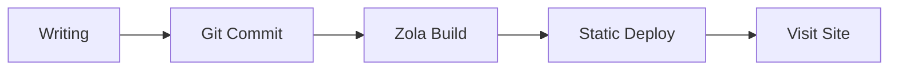
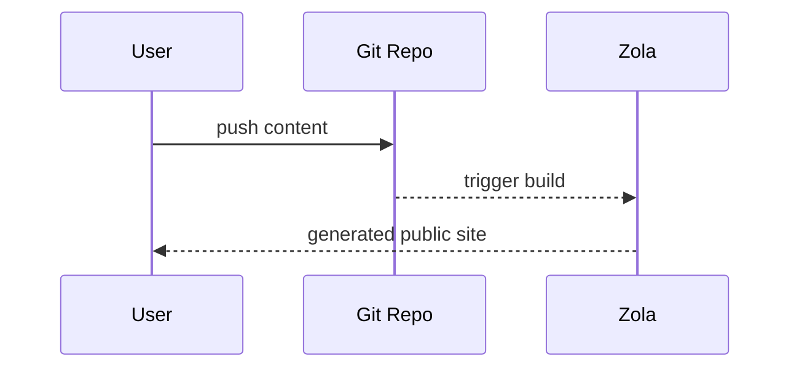
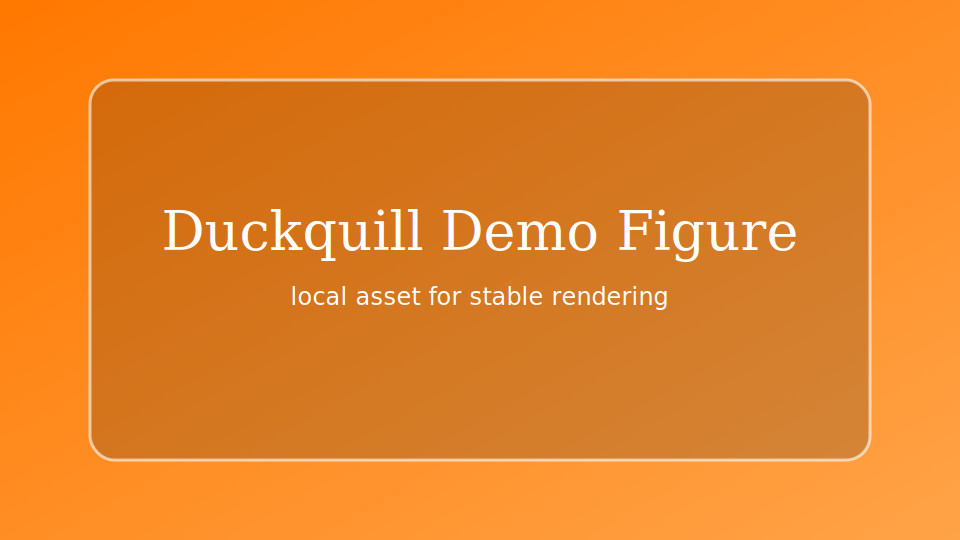

+++
authors = ["canxin"]
title = "機能デモブログ: リッチテキスト、Mermaid、数式、ショートコード"
description = "このデモ記事では、Duckquill + Zola が対応する主要な書式機能（Mermaid、KaTeX、タスクリスト、表、ショートコード、HTML 拡張）をまとめて紹介します。"
date = 2026-02-13
updated = 2026-02-13
slug = "feature-demo-blog"
[taxonomies]
tags = ["demo", "zola", "duckquill", "markdown", "mermaid", "katex"]
[extra]
featured = true
toc = true
toc_inline = true
toc_ordered = true
toc_sidebar = false
katex = true
banner = "banner-feature-en.png"
accent_color = "#14897b"
accent_color_dark = "#4fd1b6"
emoji_favicon = "🧪"
styles = ["css/feature-demo-blog.css"]
scripts = ["js/feature-demo-blog.js"]
go_to_top = true
archive = "このページは、テーマやエンジンの更新に合わせて継続的に拡張していきます。"
trigger = "このページには多くのフォーマットデモ（外部メディア、折りたたみブロック、動的ビジュアルを含む）があるため、必要に応じて各セクションを展開してください。"
disclaimer = """
- これは表示機能を確認するためのショーケースページです。
- 一部の画像/動画は外部ソースのため、読み込み速度が異なる場合があります。
"""
+++

この記事は、このサイトの**デモ用ブログページ**です。リッチテキストと拡張フォーマット機能を一か所に集約して検証する目的で作成しています。

## 基本的な Markdown 機能

テキストスタイル: **太字**、*斜体*、~~取り消し~~、`インラインコード`、さらに組み合わせた ***~~全部入り~~*** も可能です。

- 内部リンク: [ホーム](@/_index.md)
- 外部リンク: [Zola Documentation](https://www.getzola.org/documentation/)
- 絵文字: 😭😂🥺🤣❤️✨🙏😍🥰😊

> これは引用ブロックです。
>
> ネストした引用の例:
> > Duckquill は、明確で構造化された技術文書にとても向いています。

## リスト、タスク、脚注

- 通常リスト項目 A
- 通常リスト項目 B
  - ネスト項目 B.1
  - ネスト項目 B.2
- 通常リスト項目 C

1. コンテンツを書く
2. ローカルでプレビューする
3. 公開する

- [x] タスク 1: 一般的な Markdown 拡張を有効化
- [x] タスク 2: Mermaid サポートを追加
- [x] タスク 3: ショーケース記事として再構成
- [ ] タスク 4: 実運用に近い例を継続的に追加

脚注の例[^note1] とリンク付き脚注[^note2]。

Definition List の例:

Mermaid
: テキストでグラフ構造を記述し、自動的に SVG として描画します。

KaTeX
: LaTeX 数式を高速にレンダリングします。

Duckquill Shortcodes
: `alert`、`image`、`video`、`youtube` などのテーマレベル機能拡張です。

## 表とコードハイライト

| 機能 | 状態 | メモ |
| :-- | :--: | :-- |
| GitHub Alerts | 有効 | `[!NOTE]` などの構文に対応 |
| Syntax Highlighting | 有効 | 行番号と強調行に対応 |
| Mermaid | 有効 | `mermaid` コードブロックの描画に対応 |
| KaTeX | このページで有効 | `extra.katex = true` で有効化 |

```rust
fn main() {
    println!("Duckquill demo blog");
}
```

```toml, linenos, hl_lines=2-4
[extra]
show_copy_button = true
show_reading_time = true
show_share_button = true
```

## GitHub スタイルのアラート

> [!NOTE]
> 背景情報を補足するための NOTE アラートです。

> [!TIP]
> 実用的な提案を示すための TIP アラートです。

> [!IMPORTANT]
> 重要な手順を強調するための IMPORTANT アラートです。

> [!WARNING]
> 想定される問題を注意喚起するための WARNING アラートです。

> [!CAUTION]
> リスクのある操作を説明するための CAUTION アラートです。

## KaTeX 数式

インライン数式: $E = mc^2$。

ブロック数式:

$$
f(x) = \int_{-\infty}^{\infty}\hat{f}(\xi)e^{2\pi i\xi x}\,d\xi
$$

## Mermaid 図

次の `mermaid` ブロックはフローチャートとして描画されます:



シーケンス図の例:



## Duckquill ショートコード

`alert` ショートコード（GitHub Alerts とは別の、テーマ側ショートコードです）:


これは `note` ショートコードのアラートです。



これは `tip` ショートコードのアラートです。



これは `important` ショートコードのアラートです。



これは `warning` ショートコードのアラートです。



これは `caution` ショートコードのアラートです。


画像ショートコード（基本例）:

{{ image(url="figure-demo.svg", alt="Local feature demo figure", full=true, no_hover=true, transparent=true) }}

画像ショートコード（オプション多めの例）:

{{ image(url="https://upload.wikimedia.org/wikipedia/commons/b/b4/JPEG_example_JPG_RIP_100.jpg", url_min="https://upload.wikimedia.org/wikipedia/commons/3/38/JPEG_example_JPG_RIP_010.jpg", alt="Compressed preview demo", no_hover=true) }}

{{ image(url="figure-demo.svg", alt="Feature local figure", full=true, no_hover=true, transparent=true) }}

{{ image(url="figure-demo.svg", alt="Float start demo", start=true, no_hover=true, transparent=true) }}
このテキストは `start` 浮動画像の挙動を示します。画像が段落の先頭側に寄り添って配置されます。

\
{{ image(url="figure-demo.svg", alt="Float end demo", end=true, no_hover=true, transparent=true) }}
このテキストは `end` 浮動画像の挙動を示します。画像が段落の末尾側に寄り添って配置されます。

{{ image(url="https://files.catbox.moe/lk7nee.jpg", alt="Spoiler image demo", spoiler=true) }}

{{ image(url="https://files.catbox.moe/lk7nee.jpg", alt="Solid spoiler image demo", spoiler=true, solid=true) }}

動画ショートコード（基本例と autoplay 例）:

{{ video(url="https://interactive-examples.mdn.mozilla.net/media/cc0-videos/flower.webm", alt="Flower wake up", controls=true, muted=true, loop=true) }}

{{ video(url="https://upload.wikimedia.org/wikipedia/commons/transcoded/0/0e/Duckling_preening_%2881313%29.webm/Duckling_preening_%2881313%29.webm.720p.vp9.webm", alt="Duckling preening", controls=true, autoplay=true, muted=true, playsinline=true) }}

YouTube / Vimeo / Mastodon ショートコード向けリンク:

- [YouTube の例リンク](https://www.youtube.com/watch?v=0Da8ZhKcNKQ)
- [Vimeo の例リンク](https://vimeo.com/)
- [Mastodon の例リンク](https://toot.community/@sungsphinx/111789185826519979)

（注: このショーケースではサードパーティ埋め込みのコンソール出力を抑えるため、ここではリンク表示にしています。）

CRT ショートコード:


```text
user@duckquill-demo:~$ zola check
Checking site...
-> Site content: OK
```


## HTML 拡張機能

<details>
  <summary>クリックして折りたたみパネルを展開</summary>

  ここには、リスト・画像・コードスニペットなど任意の内容を配置できます。

  - 折りたたみ内容 A
  - 折りたたみ内容 B
</details>

<aside>
これは `aside` ブロックです。補足メモに便利です。
</aside>

一般的なインライン HTML タグもそのまま使えます:

- <abbr title="American Standard Code for Information Interchange">ASCII</abbr>
- <kbd>Ctrl</kbd> + <kbd>K</kbd>
- <mark>強調したいキーテキスト</mark>
- <span class="spoiler">これはスポイラーテキストです</span>
- <span class="spoiler solid">これはソリッドスポイラーテキストです</span>
- <del>旧プラン</del> <ins>新プラン</ins>
- <q>これはインライン引用です</q>
- <samp>demo-output.log: all checks passed</samp>
- <u>この文には下線があります</u>

<small>これは `<small>` を使った補足テキスト例です。</small>

フォームと操作ウィジェットの例:

<ul>
  <li><input class="switch" type="checkbox" checked /><label>&nbsp;Mermaid を有効化</label></li>
  <li><input class="switch" type="checkbox" /><label>&nbsp;KaTeX を有効化</label></li>
  <li><input class="switch big" type="checkbox" checked /><label>&nbsp;Backlinks を有効化</label></li>
  <li><input type="radio" name="theme-demo" checked /><label>&nbsp;Dark</label></li>
  <li><input type="radio" name="theme-demo" /><label>&nbsp;Light</label></li>
</ul>

<label for="accent-color">アクセントカラー:</label>
<input id="accent-color" type="color" value="#14897b" />

<label for="demo-range">コンテンツ密度:</label>
<input id="demo-range" type="range" max="100" value="72" />

<div id="demo-live-panel">
  <small id="accent-preview">現在のアクセントカラー: #14897b</small>
  <small id="density-preview">コンテンツ密度: 72%</small>
</div>

画像 + キャプション構成（`figure` + `figcaption`）:

<figure>
  
  <figcaption>ローカル画像 + figcaption（外部依存がなく、安定して描画できます）。</figcaption>
</figure>

進捗バーの例（ページスクリプトで range 入力と連動）:

<progress id="density-progress" value="72" max="100"></progress>

## ボタンとクイックナビゲーション

<div class="buttons">
  <a href="#top">ページ先頭へ戻る</a>
  <a class="colored external" href="https://www.getzola.org/documentation/content/overview/">Zola のコンテンツドキュメントを読む</a>
</div>

<div class="buttons centered">
  <button class="big colored" type="button" disabled>大型ボタンスタイルのデモ</button>
</div>

## ページ単位の Front Matter 機能

`featured = true` に加えて、このページでは次もデモしています:

- `banner = "banner-feature-en.png"`: 記事バナーと一覧サムネイル。
- `accent_color` / `accent_color_dark`: ページ単位のアクセント色上書き。
- `styles = ["css/feature-demo-blog.css"]` と `scripts = ["js/feature-demo-blog.js"]`: ページ専用スタイルとスクリプト。
- `emoji_favicon = "🧪"`: ブラウザタブ用の絵文字ファビコン。

このセクションは、ページ単位設定の描画を確認するための簡易チェックリストです。

## Backlinks デモ

この投稿へのリンクを [自己紹介](@/_index.md) ページから追加しています。

クイックアクションボタンに `Backlinks` が表示されれば、内部バックリンク索引は正常に動作しています。

---

上記の各モジュールが正しく描画されれば、このブログのリッチテキスト機能は一般的な執筆シナリオの大半をカバーできています。

[^note1]: 脚注は、本文の流れを止めずに補足説明を加えるのに便利です。
[^note2]: [脚注にはリンクも含められます](https://www.getzola.org/documentation/content/overview/)
