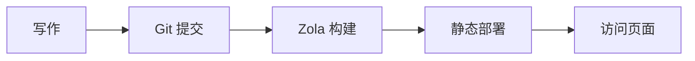
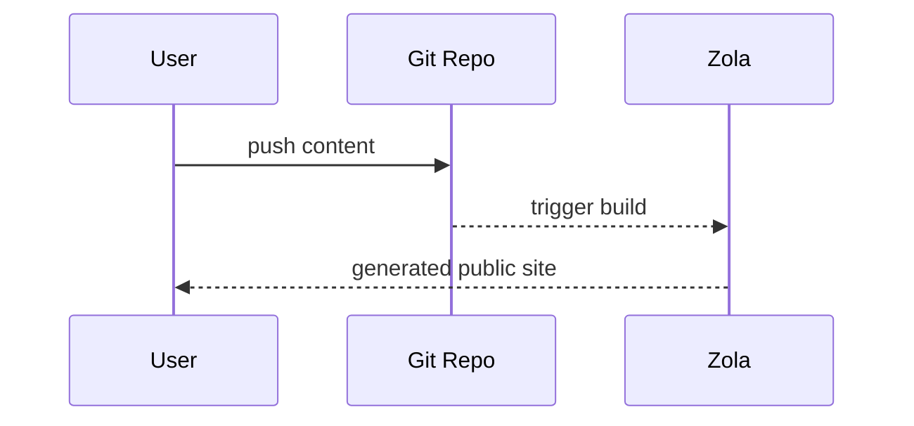

+++
authors = ["canxin"]
title = "博客功能演示：富文本、Mermaid、公式与短代码"
description = "这篇演示博客集中展示 Duckquill + Zola 支持的主要格式能力，包括 Mermaid、KaTeX、任务列表、表格、短代码和 HTML 扩展。"
date = 2026-02-13
updated = 2026-02-13
slug = "feature-demo-blog"
[taxonomies]
tags = ["demo", "zola", "duckquill", "markdown", "mermaid", "katex"]
[extra]
featured = true
toc = true
toc_inline = true
toc_ordered = true
toc_sidebar = false
katex = true
banner = "banner-feature.png"
accent_color = "#14897b"
accent_color_dark = "#4fd1b6"
emoji_favicon = "🧪"
styles = ["css/feature-demo-blog.css"]
scripts = ["js/feature-demo-blog.js"]
go_to_top = true
archive = "本文内容会持续补充，示例可能随主题/引擎版本更新而变化。"
trigger = "本页包含大量格式示例（含外部媒体、可折叠内容和动态图示），请按需展开。"
disclaimer = """
- 本文是演示页，重点在于展示渲染能力。
- 部分图片/视频来自外部站点，加载速度取决于网络。
"""
+++

这篇文章现在是本站的**演示博客**，用来集中展示我当前博客支持的富文本与扩展格式。

## 基础 Markdown 能力

文本样式：**加粗**、*斜体*、~~删除线~~、`行内代码`、以及组合样式 ***~~都可以叠加~~***。

- 内部链接： [首页](@/_index.md)
- 外部链接： [Zola 文档](https://www.getzola.org/documentation/)
- Emoji：😭😂🥺🤣❤️✨🙏😍🥰😊

> 这是一段引用。
>
> 下面是一段嵌套引用：
> > Duckquill 很适合做结构清晰的技术博客。

## 列表、任务与脚注

- 普通列表项 A
- 普通列表项 B
  - 子项 B.1
  - 子项 B.2
- 普通列表项 C

1. 先写内容
2. 再本地预览
3. 最后发布

- [x] 任务 1：开启常用 Markdown 扩展
- [x] 任务 2：支持 Mermaid
- [x] 任务 3：改造为演示博客
- [ ] 任务 4：继续补充更多实战案例

脚注示例[^note1] 和链接脚注[^note2]。

定义列表（Definition List）示例：

Mermaid
: 用文本描述图结构，再自动渲染成 SVG。

KaTeX
: 用于高性能渲染 LaTeX 数学公式。

Duckquill Shortcodes
: 主题级能力扩展，例如 `alert`、`image`、`video`、`youtube`。

## 表格与代码高亮

| 功能 | 状态 | 说明 |
| :-- | :--: | :-- |
| GitHub Alerts | 已开启 | 兼容 `[!NOTE]` 等语法 |
| 语法高亮 | 已开启 | 支持行号与高亮行 |
| Mermaid | 已开启 | 支持 `mermaid` 代码块渲染 |
| KaTeX | 本页开启 | 通过 `extra.katex = true` |

```rust
fn main() {
    println!("Duckquill demo blog");
}
```

```toml, linenos, hl_lines=2-4
[extra]
show_copy_button = true
show_reading_time = true
show_share_button = true
```

## GitHub 风格提示块

> [!NOTE]
> 这是一条 NOTE：用于补充背景信息。

> [!TIP]
> 这是一条 TIP：用于提供实用建议。

> [!IMPORTANT]
> 这是一条 IMPORTANT：用于强调关键步骤。

> [!WARNING]
> 这是一条 WARNING：用于提醒潜在问题。

> [!CAUTION]
> 这是一条 CAUTION：用于说明风险行为。

## KaTeX 公式

行内公式：$E = mc^2$。

块级公式：

$$
f(x) = \int_{-\infty}^{\infty}\hat{f}(\xi)e^{2\pi i\xi x}\,d\xi
$$

## Mermaid 图示

下面这段 `mermaid` 代码块会被自动渲染为流程图：



再来一个时序图示例：



## Duckquill Shortcodes

短代码 alert（与 GitHub alerts 不同，这是主题 shortcode）：


这是 `note` 类型的 shortcode 提示。



这是 `tip` 类型的 shortcode 提示。



这是 `important` 类型的 shortcode 提示。



这是 `warning` 类型的 shortcode 提示。



这是 `caution` 类型的 shortcode 提示。


图片 shortcode（基础用法）：

{{ image(url="figure-demo.svg", alt="Local feature demo figure", full=true, no_hover=true, transparent=true) }}

图片 shortcode（更多变量）：

{{ image(url="https://upload.wikimedia.org/wikipedia/commons/b/b4/JPEG_example_JPG_RIP_100.jpg", url_min="https://upload.wikimedia.org/wikipedia/commons/3/38/JPEG_example_JPG_RIP_010.jpg", alt="Compressed preview demo", no_hover=true) }}

{{ image(url="figure-demo.svg", alt="Feature local figure", full=true, no_hover=true, transparent=true) }}

{{ image(url="figure-demo.svg", alt="Float start demo", start=true, no_hover=true, transparent=true) }}
这段文本用于演示 `start` 浮动图片效果，图片会贴在段落起始侧。

\
{{ image(url="figure-demo.svg", alt="Float end demo", end=true, no_hover=true, transparent=true) }}
这一段用于演示 `end` 浮动图片效果，图片会贴在段落末尾侧。

{{ image(url="https://files.catbox.moe/lk7nee.jpg", alt="Spoiler image demo", spoiler=true) }}

{{ image(url="https://files.catbox.moe/lk7nee.jpg", alt="Solid spoiler image demo", spoiler=true, solid=true) }}

视频 shortcode（基础与自动播放示例）：

{{ video(url="https://interactive-examples.mdn.mozilla.net/media/cc0-videos/flower.webm", alt="Flower wake up", controls=true, muted=true, loop=true) }}

{{ video(url="https://upload.wikimedia.org/wikipedia/commons/transcoded/0/0e/Duckling_preening_%2881313%29.webm/Duckling_preening_%2881313%29.webm.720p.vp9.webm", alt="Duckling preening", controls=true, autoplay=true, muted=true, playsinline=true) }}

YouTube / Vimeo / Mastodon shortcode：

- [YouTube 示例链接](https://www.youtube.com/watch?v=0Da8ZhKcNKQ)
- [Vimeo 示例链接](https://vimeo.com/)
- [Mastodon 示例链接](https://toot.community/@sungsphinx/111789185826519979)

（注：为避免第三方播放器脚本造成控制台噪音，这里改为链接演示。）

CRT shortcode：


```text
user@duckquill-demo:~$ zola check
Checking site...
-> Site content: OK
```


## HTML 扩展能力

<details>
  <summary>点击展开一个折叠面板</summary>

  这里可以放任何内容，比如列表、图片、代码片段。

  - 折叠内容 A
  - 折叠内容 B
</details>

<aside>
这是一个 `aside` 侧注块，适合放补充说明。
</aside>

常见行内标签也可直接使用：

- <abbr title="American Standard Code for Information Interchange">ASCII</abbr>
- <kbd>Ctrl</kbd> + <kbd>K</kbd>
- <mark>重点高亮文本</mark>
- <span class="spoiler">这是一段 spoiler 文本</span>
- <span class="spoiler solid">这是一段 solid spoiler 文本</span>
- <del>旧方案</del> <ins>新方案</ins>
- <q>这是一段行内引用</q>
- <samp>demo-output.log: all checks passed</samp>
- <u>这一段文本使用了下划线标注</u>

<small>这是一个 `<small>` 侧注文本示例。</small>

表单与交互控件示例：

<ul>
  <li><input class="switch" type="checkbox" checked /><label>&nbsp;Enable Mermaid</label></li>
  <li><input class="switch" type="checkbox" /><label>&nbsp;Enable KaTeX</label></li>
  <li><input class="switch big" type="checkbox" checked /><label>&nbsp;Enable Backlinks</label></li>
  <li><input type="radio" name="theme-demo" checked /><label>&nbsp;Dark</label></li>
  <li><input type="radio" name="theme-demo" /><label>&nbsp;Light</label></li>
</ul>

<label for="accent-color">Accent color:</label>
<input id="accent-color" type="color" value="#14897b" />

<label for="demo-range">Content density:</label>
<input id="demo-range" type="range" max="100" value="72" />

<div id="demo-live-panel">
  <small id="accent-preview">当前强调色：#14897b</small>
  <small id="density-preview">内容密度：72%</small>
</div>

图文组合（`figure` + `figcaption`）：

<figure>
  
  <figcaption>本地图片 + figcaption（无外链依赖，确保稳定可见）。</figcaption>
</figure>

进度条示例（由页面脚本联动 range 输入）：

<progress id="density-progress" value="72" max="100"></progress>

## 按钮与快捷跳转

<div class="buttons">
  <a href="#top">回到顶部</a>
  <a class="colored external" href="https://www.getzola.org/documentation/content/overview/">查看 Zola 内容文档</a>
</div>

<div class="buttons centered">
  <button class="big colored" type="button" disabled>大按钮样式演示</button>
</div>

## 页面级 Front Matter 功能演示

本页除了 `featured = true`，还演示了这些页面级能力：

- `banner = "banner-feature.png"`：文章头图与列表缩略图。
- `accent_color` / `accent_color_dark`：页面级强调色覆盖。
- `styles = ["css/feature-demo-blog.css"]` 与 `scripts = ["js/feature-demo-blog.js"]`：页面级样式和脚本。
- `emoji_favicon = "🧪"`：标签页图标使用 emoji。

这里集中展示页面级配置能力，便于对照检查渲染行为。

## Backlinks 反向链接演示

我已经在 [about](@/_index.md) 页面加入了指向本文的链接。

如果当前页面右侧按钮里出现 `Backlinks` 项，说明站内反向链接索引正常生效。

---

如果你能看到上面的所有模块都正常渲染，说明当前博客的富文本能力已经可以覆盖常见写作场景。

[^note1]: 脚注可以用来放解释说明，不打断正文阅读。
[^note2]: [脚注也可以放链接](https://www.getzola.org/documentation/content/overview/)
