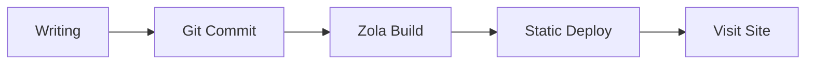
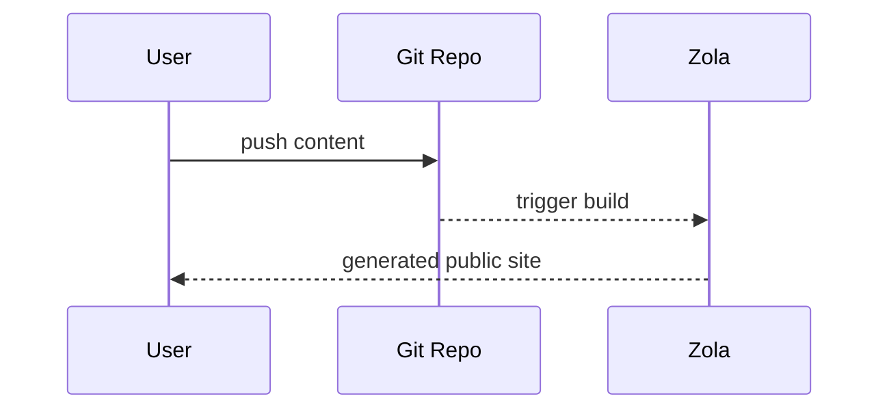

+++
authors = ["canxin"]
title = "Post de Demo de Recursos: Texto Rico, Mermaid, Matematica e Shortcodes"
description = "Este post de demonstracao mostra os principais recursos de formatacao suportados por Duckquill + Zola, incluindo Mermaid, KaTeX, listas de tarefas, tabelas, shortcodes e extensoes HTML."
date = 2026-02-13
updated = 2026-02-13
slug = "feature-demo-blog"
[taxonomies]
tags = ["demo", "zola", "duckquill", "markdown", "mermaid", "katex"]
[extra]
featured = true
toc = true
toc_inline = true
toc_ordered = true
toc_sidebar = false
katex = true
banner = "banner-feature-en.png"
accent_color = "#14897b"
accent_color_dark = "#4fd1b6"
emoji_favicon = "🧪"
styles = ["css/feature-demo-blog.css"]
scripts = ["js/feature-demo-blog.js"]
go_to_top = true
archive = "Esta pagina continua evoluindo conforme o tema e o motor sao atualizados."
trigger = "Esta pagina contem varias demos de formato (incluindo midia externa, blocos recolhiveis e visuais dinamicos), entao sinta-se livre para expandir as secoes."
disclaimer = """
- Esta e uma pagina vitrine, focada em capacidades de renderizacao.
- Algumas imagens/videos vem de fontes externas e podem carregar em velocidades diferentes.
"""
+++

Este post e a **pagina de demo do blog** deste site, usada para centralizar e validar recursos de texto rico e formatacao estendida.

## Recursos Basicos de Markdown

Estilos de texto: **negrito**, *italico*, ~~tachado~~, `codigo inline` e ate estilo combinado ***~~tudo junto~~***.

- Link interno: [Home](@/_index.md)
- Link externo: [Documentacao do Zola](https://www.getzola.org/documentation/)
- Emoji: 😭😂🥺🤣❤️✨🙏😍🥰😊

> Este e um bloco de citacao.
>
> Aqui vai uma citacao aninhada:
> > Duckquill e excelente para escrita tecnica clara e estruturada.

## Listas, Tarefas e Notas de Rodape

- Item normal A
- Item normal B
  - Item aninhado B.1
  - Item aninhado B.2
- Item normal C

1. Escrever conteudo
2. Visualizar localmente
3. Publicar

- [x] Tarefa 1: Habilitar extensoes comuns de Markdown
- [x] Tarefa 2: Adicionar suporte a Mermaid
- [x] Tarefa 3: Refatorar para um post vitrine
- [ ] Tarefa 4: Continuar adicionando exemplos praticos do mundo real

Exemplo de nota de rodape[^note1] e nota com link[^note2].

Exemplo de lista de definicao:

Mermaid
: Descreva estruturas de grafo com texto e renderize para SVG automaticamente.

KaTeX
: Renderizacao de alta performance para formulas matematicas em LaTeX.

Shortcodes do Duckquill
: Extensoes de recursos no nivel do tema, como `alert`, `image`, `video` e `youtube`.

## Tabelas e Realce de Codigo

| Recurso | Status | Observacoes |
| :-- | :--: | :-- |
| Alertas estilo GitHub | Ativado | Suporta sintaxe `[!NOTE]` e similares |
| Syntax Highlighting | Ativado | Suporta numeros de linha e linhas destacadas |
| Mermaid | Ativado | Suporta renderizacao via blocos `mermaid` |
| KaTeX | Ativado nesta pagina | Via `extra.katex = true` |

```rust
fn main() {
    println!("Duckquill demo blog");
}
```

```toml, linenos, hl_lines=2-4
[extra]
show_copy_button = true
show_reading_time = true
show_share_button = true
```

## Alertas estilo GitHub

> [!NOTE]
> Este e um alerta NOTE, usado para contexto de fundo.

> [!TIP]
> Este e um alerta TIP, usado para sugestoes praticas.

> [!IMPORTANT]
> Este e um alerta IMPORTANT, usado para enfatizar passos criticos.

> [!WARNING]
> Este e um alerta WARNING, usado para destacar problemas potenciais.

> [!CAUTION]
> Este e um alerta CAUTION, usado para descrever comportamentos de risco.

## Formulas com KaTeX

Formula inline: $E = mc^2$.

Formula em bloco:

$$
f(x) = \int_{-\infty}^{\infty}\hat{f}(\xi)e^{2\pi i\xi x}\,d\xi
$$

## Diagramas Mermaid

O bloco `mermaid` a seguir e renderizado como fluxograma:



Outro exemplo de diagrama de sequencia:



## Shortcodes do Duckquill

Shortcode `alert` (diferente dos alertas do GitHub; aqui e shortcode do tema):


Este e um alerta de shortcode `note`.



Este e um alerta de shortcode `tip`.



Este e um alerta de shortcode `important`.



Este e um alerta de shortcode `warning`.



Este e um alerta de shortcode `caution`.


Shortcode de imagem (uso basico):

{{ image(url="figure-demo.svg", alt="Figura local de demo de recursos", full=true, no_hover=true, transparent=true) }}

Shortcode de imagem (mais opcoes):

{{ image(url="https://upload.wikimedia.org/wikipedia/commons/b/b4/JPEG_example_JPG_RIP_100.jpg", url_min="https://upload.wikimedia.org/wikipedia/commons/3/38/JPEG_example_JPG_RIP_010.jpg", alt="Demo de preview comprimido", no_hover=true) }}

{{ image(url="figure-demo.svg", alt="Figura local de recurso", full=true, no_hover=true, transparent=true) }}

{{ image(url="figure-demo.svg", alt="Demo de float no inicio", start=true, no_hover=true, transparent=true) }}
Este texto demonstra o comportamento de imagem flutuante `start`, onde a imagem fica no inicio do paragrafo.

\
{{ image(url="figure-demo.svg", alt="Demo de float no fim", end=true, no_hover=true, transparent=true) }}
Este texto demonstra o comportamento de imagem flutuante `end`, onde a imagem fica no fim do paragrafo.

{{ image(url="https://files.catbox.moe/lk7nee.jpg", alt="Demo de imagem com spoiler", spoiler=true) }}

{{ image(url="https://files.catbox.moe/lk7nee.jpg", alt="Demo de imagem com spoiler solido", spoiler=true, solid=true) }}

Shortcode de video (exemplos basico e autoplay):

{{ video(url="https://interactive-examples.mdn.mozilla.net/media/cc0-videos/flower.webm", alt="Flor despertando", controls=true, muted=true, loop=true) }}

{{ video(url="https://upload.wikimedia.org/wikipedia/commons/transcoded/0/0e/Duckling_preening_%2881313%29.webm/Duckling_preening_%2881313%29.webm.720p.vp9.webm", alt="Patinho se limpando", controls=true, autoplay=true, muted=true, playsinline=true) }}

Links de shortcode YouTube / Vimeo / Mastodon:

- [Link de exemplo do YouTube](https://www.youtube.com/watch?v=0Da8ZhKcNKQ)
- [Link de exemplo do Vimeo](https://vimeo.com/)
- [Link de exemplo do Mastodon](https://toot.community/@sungsphinx/111789185826519979)

(Nota: para evitar ruido no console por embeds de terceiros nesta vitrine, aqui mostramos apenas links.)

Shortcode CRT:


```text
user@duckquill-demo:~$ zola check
Checking site...
-> Site content: OK
```


## Recursos de Extensao HTML

<details>
  <summary>Clique para expandir um painel recolhivel</summary>

  Voce pode colocar qualquer conteudo aqui, incluindo listas, imagens ou trechos de codigo.

  - Conteudo recolhivel A
  - Conteudo recolhivel B
</details>

<aside>
Este e um bloco `aside`, util para notas suplementares.
</aside>

Tags inline de HTML comuns tambem funcionam diretamente:

- <abbr title="American Standard Code for Information Interchange">ASCII</abbr>
- <kbd>Ctrl</kbd> + <kbd>K</kbd>
- <mark>texto-chave destacado</mark>
- <span class="spoiler">isto e um texto com spoiler</span>
- <span class="spoiler solid">isto e um texto com spoiler solido</span>
- <del>plano antigo</del> <ins>plano novo</ins>
- <q>esta e uma citacao inline</q>
- <samp>demo-output.log: all checks passed</samp>
- <u>esta frase esta sublinhada</u>

<small>Este e um exemplo de nota lateral com `<small>`.</small>

Exemplos de formulario e widgets de interacao:

<ul>
  <li><input class="switch" type="checkbox" checked /><label>&nbsp;Habilitar Mermaid</label></li>
  <li><input class="switch" type="checkbox" /><label>&nbsp;Habilitar KaTeX</label></li>
  <li><input class="switch big" type="checkbox" checked /><label>&nbsp;Habilitar Backlinks</label></li>
  <li><input type="radio" name="theme-demo" checked /><label>&nbsp;Escuro</label></li>
  <li><input type="radio" name="theme-demo" /><label>&nbsp;Claro</label></li>
</ul>

<label for="accent-color">Cor de destaque:</label>
<input id="accent-color" type="color" value="#14897b" />

<label for="demo-range">Densidade de conteudo:</label>
<input id="demo-range" type="range" max="100" value="72" />

<div id="demo-live-panel">
  <small id="accent-preview">Cor de destaque atual: #14897b</small>
  <small id="density-preview">Densidade de conteudo: 72%</small>
</div>

Composicao de imagem com legenda (`figure` + `figcaption`):

<figure>
  
  <figcaption>Imagem local + figcaption (sem dependencia externa, renderizacao estavel).</figcaption>
</figure>

Exemplo de barra de progresso (vinculada ao controle range pelo script da pagina):

<progress id="density-progress" value="72" max="100"></progress>

## Botoes e Navegacao Rapida

<div class="buttons">
  <a href="#top">Voltar ao topo</a>
  <a class="colored external" href="https://www.getzola.org/documentation/content/overview/">Ler docs de conteudo do Zola</a>
</div>

<div class="buttons centered">
  <button class="big colored" type="button" disabled>Demo de estilo de botao grande</button>
</div>

## Recursos de Front Matter no Nivel da Pagina

Alem de `featured = true`, esta pagina tambem demonstra:

- `banner = "banner-feature-en.png"`: banner do post e miniatura da lista.
- `accent_color` / `accent_color_dark`: sobreposicao de cor de destaque por pagina.
- `styles = ["css/feature-demo-blog.css"]` e `scripts = ["js/feature-demo-blog.js"]`: estilos e scripts escopados para esta pagina.
- `emoji_favicon = "🧪"`: favicon em emoji para a aba do navegador.

Esta secao e um checklist compacto para validar a renderizacao de configuracoes no nivel da pagina.

## Demo de Backlinks

Adicionei um link para este post na pagina [about](@/_index.md).

Se aparecer um item `Backlinks` nos botoes de acao rapida, o indice de backlinks internos esta funcionando como esperado.

---

Se todos os modulos acima renderizarem corretamente, significa que a capacidade de texto rico do blog cobre a maioria dos cenarios comuns de escrita.

[^note1]: Notas de rodape sao otimas para explicacoes extras sem interromper o fluxo principal de leitura.
[^note2]: [Notas de rodape tambem podem conter links](https://www.getzola.org/documentation/content/overview/)
