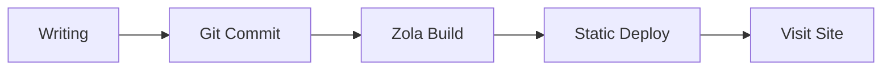
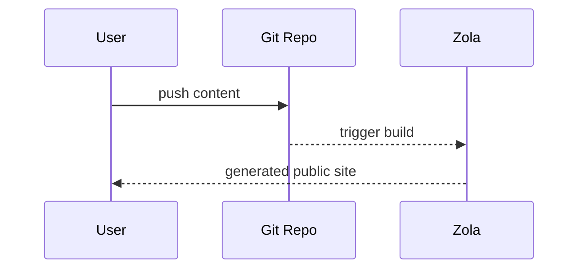

+++
authors = ["canxin"]
title = "فیچر ڈیمو بلاگ: رچ ٹیکسٹ، Mermaid، ریاضی اور Shortcodes"
description = "یہ ڈیمو پوسٹ Duckquill + Zola کی اہم فارمیٹنگ صلاحیتیں دکھاتی ہے، جن میں Mermaid، KaTeX، task lists، tables، shortcodes اور HTML extensions شامل ہیں۔"
date = 2026-02-13
updated = 2026-02-13
slug = "feature-demo-blog"
[taxonomies]
tags = ["demo", "zola", "duckquill", "markdown", "mermaid", "katex"]
[extra]
featured = true
toc = true
toc_inline = true
toc_ordered = true
toc_sidebar = false
katex = true
banner = "banner-feature-en.png"
accent_color = "#14897b"
accent_color_dark = "#4fd1b6"
emoji_favicon = "🧪"
styles = ["css/feature-demo-blog.css"]
scripts = ["js/feature-demo-blog.js"]
go_to_top = true
archive = "یہ صفحہ تھیم اور انجن کی اپ ڈیٹس کے ساتھ مسلسل بہتر ہوتا رہے گا۔"
trigger = "اس صفحے میں بہت سی فارمیٹ ڈیموز شامل ہیں (جیسے بیرونی میڈیا، collapse blocks اور dynamic visuals)، اس لیے ضرورت کے مطابق سیکشنز کھولیں۔"
disclaimer = """
- یہ ایک showcase صفحہ ہے جس کا فوکس rendering capabilities پر ہے۔
- کچھ تصاویر/ویڈیوز بیرونی ذرائع سے ہیں، اس لیے لوڈنگ رفتار مختلف ہو سکتی ہے۔
"""
+++

یہ پوسٹ اس سائٹ کی **ڈیمو بلاگ پیج** ہے، جس کا مقصد rich-text اور extended formatting صلاحیتوں کو ایک جگہ پر دکھانا اور validate کرنا ہے۔

## بنیادی Markdown صلاحیتیں

متن کی اسٹائلز: **bold**، *italic*، ~~strikethrough~~، `inline code`، اور ملا ہوا انداز ***~~all together~~***۔

- اندرونی لنک: [Home](@/_index.md)
- بیرونی لنک: [Zola Documentation](https://www.getzola.org/documentation/)
- Emoji: 😭😂🥺🤣❤️✨🙏😍🥰😊

> یہ quote block ہے۔
>
> یہاں nested quote ہے:
> > Duckquill واضح اور منظم تکنیکی لکھائی کے لیے بہت موزوں ہے۔

## Lists، Tasks اور Footnotes

- عام آئٹم A
- عام آئٹم B
  - nested آئٹم B.1
  - nested آئٹم B.2
- عام آئٹم C

1. مواد لکھیں
2. لوکل preview دیکھیں
3. شائع کریں

- [x] ٹاسک 1: عام Markdown extensions فعال کریں
- [x] ٹاسک 2: Mermaid سپورٹ شامل کریں
- [x] ٹاسک 3: اسے showcase پوسٹ میں refactor کریں
- [ ] ٹاسک 4: مزید عملی examples شامل کرتے رہیں

Footnote مثال[^note1] اور linked footnote[^note2]۔

Definition List مثال:

Mermaid
: گراف اسٹرکچر کو متن سے بیان کریں، پھر خودکار طور پر SVG میں render کریں۔

KaTeX
: LaTeX ریاضیاتی فارمولوں کی تیز رفتار rendering۔

Duckquill Shortcodes
: تھیم سطح کے فیچر extensions، جیسے `alert`, `image`, `video`, `youtube`۔

## Tables اور Code Highlighting

| فیچر | حالت | نوٹس |
| :-- | :--: | :-- |
| GitHub Alerts | فعال | `[!NOTE]` اور متعلقہ syntax سپورٹ |
| Syntax Highlighting | فعال | line numbers اور highlighted lines سپورٹ |
| Mermaid | فعال | `mermaid` code blocks سے rendering سپورٹ |
| KaTeX | اس صفحے پر فعال | `extra.katex = true` کے ذریعے |

```rust
fn main() {
    println!("Duckquill demo blog");
}
```

```toml, linenos, hl_lines=2-4
[extra]
show_copy_button = true
show_reading_time = true
show_share_button = true
```

## GitHub طرز کے Alerts

> [!NOTE]
> یہ NOTE alert ہے، جو پس منظر سیاق کے لیے استعمال ہوتا ہے۔

> [!TIP]
> یہ TIP alert ہے، عملی تجاویز کے لیے۔

> [!IMPORTANT]
> یہ IMPORTANT alert ہے، اہم مراحل پر زور دینے کے لیے۔

> [!WARNING]
> یہ WARNING alert ہے، ممکنہ مسائل کی نشاندہی کے لیے۔

> [!CAUTION]
> یہ CAUTION alert ہے، خطرناک رویوں کی وضاحت کے لیے۔

## KaTeX فارمولے

Inline formula: $E = mc^2$.

Block formula:

$$
f(x) = \int_{-\infty}^{\infty}\hat{f}(\xi)e^{2\pi i\xi x}\,d\xi
$$

## Mermaid ڈایاگرامز

نیچے دیا گیا `mermaid` بلاک flowchart کے طور پر render ہوتا ہے:



ایک اور sequence diagram مثال:



## Duckquill Shortcodes

`alert` shortcode (یہ GitHub alerts سے الگ ہے؛ یہ theme shortcode ہے):


یہ `note` shortcode alert ہے۔



یہ `tip` shortcode alert ہے۔



یہ `important` shortcode alert ہے۔



یہ `warning` shortcode alert ہے۔



یہ `caution` shortcode alert ہے۔


Image shortcode (بنیادی استعمال):

{{ image(url="figure-demo.svg", alt="Local feature demo figure", full=true, no_hover=true, transparent=true) }}

Image shortcode (مزید اختیارات):

{{ image(url="https://upload.wikimedia.org/wikipedia/commons/b/b4/JPEG_example_JPG_RIP_100.jpg", url_min="https://upload.wikimedia.org/wikipedia/commons/3/38/JPEG_example_JPG_RIP_010.jpg", alt="Compressed preview demo", no_hover=true) }}

{{ image(url="figure-demo.svg", alt="Feature local figure", full=true, no_hover=true, transparent=true) }}

{{ image(url="figure-demo.svg", alt="Float start demo", start=true, no_hover=true, transparent=true) }}
یہ متن `start` floating image behavior دکھاتا ہے، جہاں تصویر پیراگراف کے آغاز کی سمت چپکی رہتی ہے۔

\
{{ image(url="figure-demo.svg", alt="Float end demo", end=true, no_hover=true, transparent=true) }}
یہ متن `end` floating image behavior دکھاتا ہے، جہاں تصویر پیراگراف کے اختتام کی سمت چپکی رہتی ہے۔

{{ image(url="https://files.catbox.moe/lk7nee.jpg", alt="Spoiler image demo", spoiler=true) }}

{{ image(url="https://files.catbox.moe/lk7nee.jpg", alt="Solid spoiler image demo", spoiler=true, solid=true) }}

Video shortcode (بنیادی اور autoplay مثالیں):

{{ video(url="https://interactive-examples.mdn.mozilla.net/media/cc0-videos/flower.webm", alt="Flower wake up", controls=true, muted=true, loop=true) }}

{{ video(url="https://upload.wikimedia.org/wikipedia/commons/transcoded/0/0e/Duckling_preening_%2881313%29.webm/Duckling_preening_%2881313%29.webm.720p.vp9.webm", alt="Duckling preening", controls=true, autoplay=true, muted=true, playsinline=true) }}

YouTube / Vimeo / Mastodon shortcode links:

- [YouTube example link](https://www.youtube.com/watch?v=0Da8ZhKcNKQ)
- [Vimeo example link](https://vimeo.com/)
- [Mastodon example link](https://toot.community/@sungsphinx/111789185826519979)

(نوٹ: اس showcase میں third-party embeds کے شور سے بچنے کے لیے یہاں انہیں links کے طور پر دکھایا گیا ہے۔)

CRT shortcode:


```text
user@duckquill-demo:~$ zola check
Checking site...
-> Site content: OK
```


## HTML Extension صلاحیتیں

<details>
  <summary>collapsible panel کھولنے کے لیے کلک کریں</summary>

  یہاں آپ کوئی بھی مواد رکھ سکتے ہیں، جیسے lists، images یا code snippets۔

  - Collapsible content A
  - Collapsible content B
</details>

<aside>
یہ `aside` بلاک ہے، جو اضافی نوٹس کے لیے مفید ہے۔
</aside>

عام inline HTML tags بھی براہ راست کام کرتے ہیں:

- <abbr title="American Standard Code for Information Interchange">ASCII</abbr>
- <kbd>Ctrl</kbd> + <kbd>K</kbd>
- <mark>highlighted key text</mark>
- <span class="spoiler">this is a spoiler text</span>
- <span class="spoiler solid">this is a solid spoiler text</span>
- <del>old plan</del> <ins>new plan</ins>
- <q>this is an inline quotation</q>
- <samp>demo-output.log: all checks passed</samp>
- <u>this sentence is underlined</u>

<small>یہ `<small>` side note text کی مثال ہے۔</small>

فارم اور interaction widget مثالیں:

<ul>
  <li><input class="switch" type="checkbox" checked /><label>&nbsp;Mermaid فعال کریں</label></li>
  <li><input class="switch" type="checkbox" /><label>&nbsp;KaTeX فعال کریں</label></li>
  <li><input class="switch big" type="checkbox" checked /><label>&nbsp;Backlinks فعال کریں</label></li>
  <li><input type="radio" name="theme-demo" checked /><label>&nbsp;Dark</label></li>
  <li><input type="radio" name="theme-demo" /><label>&nbsp;Light</label></li>
</ul>

<label for="accent-color">Accent color:</label>
<input id="accent-color" type="color" value="#14897b" />

<label for="demo-range">Content density:</label>
<input id="demo-range" type="range" max="100" value="72" />

<div id="demo-live-panel">
  <small id="accent-preview">Current accent color: #14897b</small>
  <small id="density-preview">Content density: 72%</small>
</div>

Image + caption composition (`figure` + `figcaption`):

<figure>
  
  <figcaption>Local image + figcaption (no external dependency, stable to render).</figcaption>
</figure>

Progress bar مثال (range input کے ساتھ page script کے ذریعے منسلک):

<progress id="density-progress" value="72" max="100"></progress>

## Buttons اور فوری نیویگیشن

<div class="buttons">
  <a href="#top">اوپر جائیں</a>
  <a class="colored external" href="https://www.getzola.org/documentation/content/overview/">Zola content docs پڑھیں</a>
</div>

<div class="buttons centered">
  <button class="big colored" type="button" disabled>بڑے بٹن اسٹائل کی ڈیمو</button>
</div>

## صفحہ سطح کے Front Matter فیچرز

`featured = true` کے علاوہ یہ صفحہ یہ بھی دکھاتا ہے:

- `banner = "banner-feature-en.png"`: پوسٹ بینر اور فہرست thumbnail.
- `accent_color` / `accent_color_dark`: صفحہ سطح پر accent override.
- `styles = ["css/feature-demo-blog.css"]` اور `scripts = ["js/feature-demo-blog.js"]`: صفحہ مخصوص styles/scripts.
- `emoji_favicon = "🧪"`: براؤزر ٹیب کے لیے emoji favicon.

یہ سیکشن صفحہ سطح کی config rendering کی توثیق کے لیے ایک مختصر checklist ہے۔

## Backlinks ڈیمو

میں نے [about](@/_index.md) صفحے سے اس پوسٹ کا ایک لنک شامل کیا ہے۔

اگر quick-action buttons میں `Backlinks` آئٹم نظر آئے تو internal backlink index درست چل رہا ہے۔

---

اگر اوپر کے تمام modules صحیح render ہوں تو اس کا مطلب ہے کہ بلاگ کی rich-text صلاحیت اب زیادہ تر عام لکھائی کے scenarios کور کرتی ہے۔

[^note1]: Footnotes اضافی وضاحت کے لیے بہترین ہیں، بغیر مرکزی مطالعہ کے بہاؤ کو روکے۔
[^note2]: [Footnotes میں links بھی شامل کیے جا سکتے ہیں](https://www.getzola.org/documentation/content/overview/)
